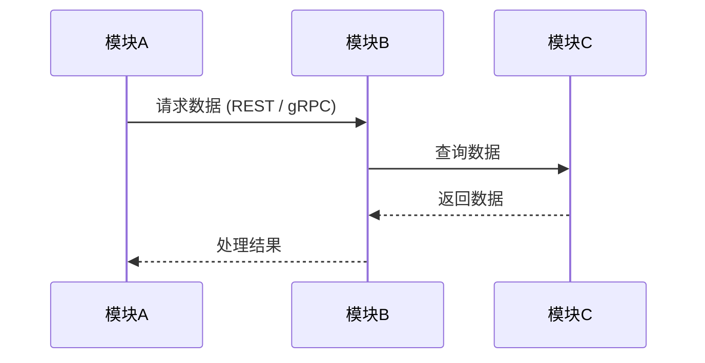
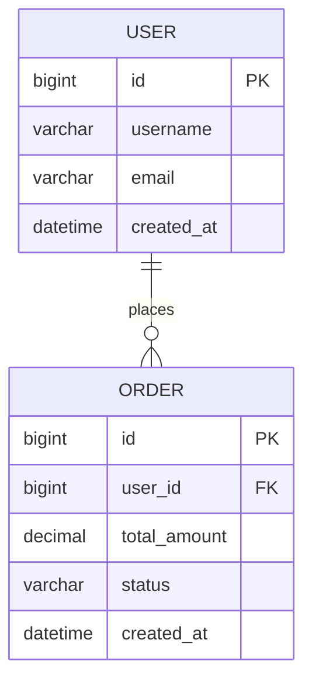
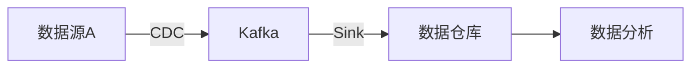

# 架构设计文档模板

> **文档类型**: 架构设计文档 (Architecture Design Document)  
> **负责角色**: 架构师 (Architect)  
> **文档位置**: `docs/architect/ARCHITECTURE_DESIGN_<项目名称>_<版本号>.md`

---

## 文档信息

| 项目 | 内容 |
|------|------|
| 文档名称 | |
| 项目名称 | |
| 版本号 | v1.0.0 |
| 创建日期 | YYYY-MM-DD |
| 最后更新 | YYYY-MM-DD |
| 负责架构师 | |
| 审核人 | |
| 状态 | 草稿/评审中/已批准/已归档 |

---

## 更新履历

| 版本 | 日期 | 更新人 | 更新内容 | 审核状态 |
|------|------|--------|----------|----------|
| v1.0.0 | YYYY-MM-DD | 架构师姓名 | 初始版本创建 | 待审核 |
| v1.1.0 | YYYY-MM-DD | 架构师姓名 | 更新内容描述 | 已审核 |

---

## 1. 项目概述

### 1.1 项目背景
- **业务背景**: 描述项目的业务背景和业务价值
- **技术背景**: 描述技术选型的背景和约束条件
- **项目目标**: 明确项目的核心目标和成功标准

### 1.2 范围定义
- **包含范围**: 明确包含在架构设计中的内容
- **排除范围**: 明确不包含在架构设计中的内容
- **边界定义**: 系统与外部系统的边界

### 1.3 关键干系人
- **业务方**: 业务负责人和需求提出方
- **技术方**: 技术团队和相关系统负责人
- **运维方**: 运维团队和基础设施负责人

---

## 2. 架构愿景

### 2.1 架构目标
- **业务目标**: 架构需要支撑的业务目标
- **技术目标**: 架构需要达成的技术指标 (如高可用、高性能)
- **质量目标**: 架构需要满足的质量属性 (如可维护性、可测试性)

### 2.2 架构原则
- **高内聚低耦合**: 模块职责清晰，依赖关系合理
- **云原生优先**: 充分利用云原生能力 (K8s, Istio, Observability)
- **安全左移**: 安全设计贯穿开发全生命周期
- **可观测性**: 系统状态透明，故障快速定位
- **技术前瞻性**: 采用主流且稳定的技术栈 (Spring Boot 3, Java 21)

### 2.3 技术约束
- **技术栈约束**: 必须使用的技术栈
- **集成约束**: 必须集成的现有系统
- **合规约束**: 必须满足的合规要求 (如 GDPR, 等保)

---

## 3. 系统架构设计

### 3.1 总体架构

#### 3.1.1 架构图
```mermaid
graph TB
    subgraph 外部系统
        A[用户端]
        B[第三方服务]
    end
    
    subgraph 接入层
        C[API Gateway / Ingress]
    end
    
    subgraph 业务服务层
        D[服务A (Spring Boot 3)]
        E[服务B (Spring Boot 3)]
    end
    
    subgraph 数据层
        F[MySQL 8.0]
        G[Redis 7.x]
        H[Kafka / RabbitMQ]
    end
    
    subgraph 可观测性
        I[Prometheus]
        J[Grafana]
        K[Zipkin / Jaeger]
    end
    
    A --> C
    B --> C
    C --> D
    C --> E
    D --> F
    D --> G
    E --> H
    D -.-> I
    E -.-> I
```

#### 3.1.2 架构分层
| 层级 | 职责 | 技术组件 | 部署位置 |
|------|------|----------|----------|
| 接入层 | 流量接入、认证鉴权、限流熔断 | Spring Cloud Gateway / APISIX | 公网区 |
| 应用层 | 业务逻辑处理、聚合服务 | Spring Boot 3 (Java 21) | 应用区 |
| 服务层 | 领域服务实现、微服务 | Spring Boot 3 (Java 21) | 应用区 |
| 数据层 | 数据存储和访问 | MySQL 8.0, Redis 7.x | 数据区 |

### 3.2 模块设计

#### 3.2.1 模块划分
| 模块名称 | 模块职责 | 依赖模块 | 被依赖模块 |
|----------|----------|----------|------------|
| 模块A | 职责描述 | 模块B, 模块C | 模块D |
| 模块B | 职责描述 | 模块C | 模块A |

#### 3.2.2 模块交互图


### 3.3 接口设计

#### 3.3.1 外部接口
| 接口名称 | 接口类型 | 协议 | 输入 | 输出 | 异常处理 |
|----------|----------|------|------|------|----------|
| 接口A | REST API | HTTP/JSON | Request Record | Response Record | ProblemDetails |
| 接口B | RPC | gRPC | Proto Message | Proto Message | 异常定义 |

#### 3.3.2 内部接口
| 接口名称 | 调用方 | 被调用方 | 调用方式 | 数据格式 |
|----------|--------|----------|----------|----------|
| 接口A | 服务A | 服务B | 同步调用 (RestClient) | JSON |
| 接口B | 服务B | 服务C | 异步消息 (Spring Cloud Stream) | Protobuf / JSON |

### 3.4 数据架构

#### 3.4.1 数据模型


#### 3.4.2 数据流转


---

## 4. 技术架构

### 4.1 技术栈选型

#### 4.1.1 前端技术栈
| 技术领域 | 选型 | 版本 | 选型理由 |
|----------|------|------|----------|
| 框架 | React / Vue | v18 / v3 | 生态完善 |
| 状态管理 | Redux Toolkit / Pinia | latest | 社区活跃 |
| UI组件库 | Ant Design / Element Plus | latest | 企业级组件 |

#### 4.1.2 后端技术栈
| 技术领域 | 选型 | 版本 | 选型理由 |
|----------|------|------|----------|
| 语言 | Java | 21 (LTS) | 虚拟线程、Record、Switch表达式 |
| 框架 | Spring Boot | 3.2+ | 原生镜像支持、可观测性增强 |
| 数据库 | MySQL / PostgreSQL | 8.0 / 16 | 稳定可靠 |
| 缓存 | Redis | 7.x | 高性能 |
| 消息队列 | Kafka / RocketMQ | latest | 高吞吐 |

#### 4.1.3 基础设施 & 可观测性
| 技术领域 | 选型 | 版本 | 选型理由 |
|----------|------|------|----------|
| 容器化 | Docker / Kubernetes | latest | 云原生标准 |
| 监控 | Prometheus + Grafana | latest | 开源生态标准 |
| 链路追踪 | Micrometer Tracing / Zipkin | latest | Spring Boot 3 原生支持 |
| 日志 | ELK / Loki | latest | 集中式日志管理 |

### 4.2 部署架构

#### 4.2.1 部署拓扑
```mermaid
graph TB
    subgraph 生产环境 (K8s Cluster)
        A[Ingress Controller] --> B[Service A Pods]
        A --> C[Service B Pods]
        B --> D[DB Cluster]
        C --> E[Redis Cluster]
    end
```

#### 4.2.2 环境规划
| 环境 | 用途 | 配置 | 数据 |
|------|------|------|------|
| 开发环境 (Dev) | 日常开发 | 2C4G | 模拟数据 |
| 测试环境 (Test) | 功能测试 | 4C8G | 测试数据 |
| 预发环境 (Staging) | 上线前验证 | 8C16G | 生产脱敏数据 |
| 生产环境 (Prod) | 正式服务 | 弹性伸缩 | 生产数据 |

---

## 5. 质量属性设计

### 5.1 性能设计

#### 5.1.1 性能指标
| 指标项 | 目标值 | 测试方法 | 优化策略 |
|--------|--------|----------|----------|
| 响应时间 | P99 < 200ms | 压力测试 (K6/JMeter) | 缓存+异步+虚拟线程 |
| 吞吐量 | QPS > 1000 | 负载测试 | 水平扩展 |
| 并发数 | 支持1000并发 | 并发测试 | 连接池优化 |

#### 5.1.2 性能优化策略
- **Java 21**: 启用虚拟线程 (Virtual Threads) 提升高并发吞吐
- **缓存策略**: 多级缓存设计（Caffeine + Redis）
- **数据库优化**: 索引优化、分库分表、读写分离
- **异步处理**: 消息队列解耦、Spring @Async

### 5.2 可用性设计

#### 5.2.1 可用性指标
| 指标项 | 目标值 | 实现方式 |
|--------|--------|----------|
| 可用性 | 99.99% | 多活架构 |
| MTTR | < 30分钟 | 自动化运维 |
| MTBF | > 720小时 | 高可用设计 |

#### 5.2.2 容灾设计
- **多可用区部署**: 跨 AZ 部署应用和数据
- **故障转移**: 自动故障检测和流量切换 (Liveness/Readiness Probe)
- **限流熔断**: Resilience4j 集成

### 5.3 安全性设计

#### 5.3.1 安全架构
```mermaid
graph TB
    A[WAF] --> B[API Gateway (OAuth2 Resource Server)]
    B --> C[Identity Provider (Keycloak/Auth0)]
    B --> D[应用服务]
    D --> E[数据加密 (Vault)]
    E --> F[数据库]
```

#### 5.3.2 安全措施
| 安全领域 | 措施 | 实现方式 |
|----------|------|----------|
| 传输安全 | HTTPS/TLS 1.3 | 全链路加密 |
| 认证授权 | OAuth2 / OIDC | Spring Security 6 |
| 数据安全 | 加密存储 | AES-256 / 敏感字段脱敏 |
| 依赖安全 | SCA 扫描 | Dependency Check / Snyk |

### 5.4 可扩展性设计

#### 5.4.1 水平扩展
- **无状态设计**: 应用服务无状态，支持 K8s HPA
- **数据分片**: 数据库分库分表 (ShardingSphere)

---

## 6. 任务拆分与规划

### 6.1 架构实施任务

#### 6.1.1 任务清单
| 任务ID | 任务名称 | 任务描述 | 依赖任务 | 预估工时 | 负责人 | 状态 |
|--------|----------|----------|----------|----------|--------|------|
| ARCH-001 | 基础架构脚手架 | 基于 Spring Boot 3 搭建脚手架 (含 checkstyle, spotless) | 无 | 3天 | 架构师 | 待开始 |
| ARCH-002 | CI/CD 流水线 | 配置 Jenkins/GitLab CI 及 SonarQube | ARCH-001 | 2天 | DevOps | 待开始 |
| ARCH-003 | 核心模块开发 | 开发核心业务模块 | ARCH-001 | 5天 | 开发团队 | 待开始 |
| ARCH-004 | 接口定义 | 定义 Open API 规范 | ARCH-001 | 2天 | 架构师 | 待开始 |

---

## 7. 风险评估

### 7.1 技术风险
| 风险项 | 风险等级 | 影响范围 | 缓解措施 | 负责人 |
|--------|----------|----------|----------|--------|
| Java 21 升级兼容性 | 中 | 依赖库 | 提前进行依赖兼容性测试 | 架构师 |
| 性能未达标 | 高 | 用户体验 | 压测左移，尽早发现瓶颈 | 架构师 |

---

## 8. 附录

### 8.1 参考资料
- [Spring Boot 3.x Documentation](https://docs.spring.io/spring-boot/docs/current/reference/html/)
- [Java 21 Features](https://openjdk.org/projects/jdk/21/)
- [12-Factor App](https://12factor.net/)

---

**文档结束**

> 本文档由架构师角色创建和维护，任何修改必须更新版本号和更新履历。
