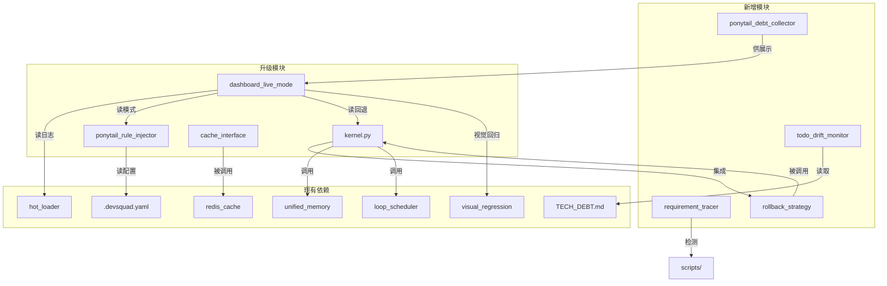

# DevSquad V4.3.0 架构设计文档

> **文档类型**: 架构设计 (Architecture Design) | **基线**: V4.2.1 (commit 1fc94aa) | **目标**: V4.3.0
> **创建日期**: 2026-07-24 | **作者**: DevSquad Architect | **状态**: DRAFT — 待 7-Role 评审
> **关联**: [V4.3 Roadmap Proposal v1.2](../planning/V43_ROADMAP_PROPOSAL.md) | [V4.1.0 Architecture](./V4.1.0_Architecture_Design.md)

---

## 1. 文档信息

| 项目 | 值 |
|------|------|
| 版本 / 日期 | V4.3.0 / 2026-07-24 |
| 作者 / 状态 | DevSquad Architect / DRAFT |
| 基线 | V4.2.1 (commit 1fc94aa) |
| SemVer | MINOR 递增（V4.2.1 → V4.3.0），全部变更向后兼容 |
| 评审 | 待 7-Role 共识评审 |

---

## 2. 架构概览

### 2.1 V4.3.0 定位

V4.3.0 是 DevSquad 架构演进的**安全债清理 + 精细化升级**版本：

1. **安全债收敛**: pickle→JSON 迁移，收敛 `pickle.loads` 的 RCE 攻击面（OWASP A08:2021）
2. **精细化升级**: V4.0.0 基础实现（Ponytail / Loop / Dashboard）升级为生产级，借鉴上游 v2.6-v2.8 的 4 个可借鉴点
3. **技术债持续治理**: 建立"扫描-登记-修复-验证"闭环
4. **保持 SemVer 合规**: 不破坏 7400+ CI 测试

### 2.2 与 V4.2.1 的架构差异（增量）

| 维度 | V4.2.1 现状 | V4.3.0 增量 |
|------|-------------|-------------|
| 缓存序列化 | JSON + pickle fallback（活跃）+ pickle dead code（2 处） | 删 dead code；fallback 安全收紧；P2-1 移除 fallback |
| Ponytail 规则 | 单一静态注入（`PONYTAIL_RULES` 原文） | lite/full 双模式 + 16 条不可简化红线 |
| Loop 回退 | 五步闭环，失败即 STOP_FAILURE | 新增 `RollbackStrategy` 精准回退 + 累计上下文 + 独立硬上限 |
| 技术债监控 | 手动扫描，无自动登记 | 新增 `todo_drift_monitor` 自动扫描-登记-对比-报告闭环 |
| Dashboard | LiveBrowserMode 审查闭环 | 新增 Ponytail 模式 / Loop 回退 / Plugin 热加载状态可视化 |
| 模块数 | 149+ 核心模块 | +4 新增模块 |

---

## 3. 模块边界设计

### 3.1 `todo_drift_monitor.py`（新增）

**定位**: 技术债持续监控的"扫描-登记-对比-报告"闭环轻量脚本（<100 行）。

- **做什么**: 扫描 `scripts/` 下 `TODO|FIXME|HACK|XXX|WIP|待办|待修复` 标记（大小写不敏感）；对比 `docs/TECH_DEBT.md` 已登记条目；输出未登记的新技术债；集成 pre-commit hook（阻塞）与 CI lint job。
- **不做什么**: 不修改源码（只读）；不自动修复（仅报告）；不扫描 `tests/` 与 `__pycache__/`；不替代 `tech_debt_manager.py`（后者管已登记条目生命周期）。

### 3.2 `ponytail_debt_collector.py`（新增）

**定位**: `# ponytail:` 注释标记的扫描 + 债务分类。

- **做什么**: 扫描 `# ponytail:` 标记（开发者标注的有意简化）；区分 UPGRADABLE（有升级路径）与 ROT_RISK（腐烂风险）；输出报告供 Dashboard 可视化。
- **不做什么**: 不修改源码；不自动升级；不与 `todo_drift_monitor` 合并（标记不同：`# ponytail:` vs `TODO/FIXME`）。

### 3.3 `requirement_tracer.py`（新增）

**定位**: `[REQ-XXX]` 标记解析 + 实现检测。

- **做什么**: 解析文档/代码中 `[REQ-XXX]` 标记；中文关键词提取；基于关键词匹配检测代码库实现。
- **不做什么**: 不做语义级映射（仅关键词级，避免过度设计）；不替代测试覆盖率工具（仅追踪"是否有实现"）；不修改源码。

### 3.4 `rollback_strategy.py`（新增）

**定位**: LoopKernel 失败阶段的精准回退目标映射。

- **做什么**: 定义 `RollbackStrategy` 类，实现 `determine_rollback_stage(failure_stage)` 映射；D1/D2/D4/D5/D6 → DEVELOPMENT；D3 → TEST_VERIFICATION。
- **不做什么**: 不执行回退动作（仅决定目标，执行由 LoopKernel 编排）；不修改现有 `SchedulingAction` 语义（新增 `ROLLBACK`）；不替代 `LoopScheduler`。

### 3.5 `ponytail_rule_injector.py`（升级）

**定位**: Ponytail 决策梯从单一静态注入升级为 lite/full 双模式。

- **做什么**: 保留 `PONYTAIL_RULES` 原文本作为 `full` 模式默认（兼容 17 现有测试）；新增 `PONYTAIL_RULES_LITE`（测试/UI 角色）；删除 `ultra` 模式（死代码）；新增 16 条不可简化红线（6 原始 + 10 项目规则）。
- **不做什么**: 不重命名 7 步梯为 6 步梯（避免破坏 `test_contains_all_7_rungs`）；不引入第三种模式（YAGNI）；不修改 `YagniChecker`（互补关系）。

### 3.6 `loop_engineering/kernel.py`（升级）

**定位**: LoopKernel 五步闭环新增精准回退能力。

- **做什么**: 集成 `RollbackStrategy`，失败时按阶段映射回退而非直接 STOP_FAILURE；新增 `_accumulated_artifacts` 跨迭代传递上下文；新增独立 `rollback_max_iterations` 硬上限（默认 3）；新增 `SchedulingAction.ROLLBACK`。
- **不做什么**: 不修改 `max_iterations`（默认 50 不变）；不重写五步闭环（仅在第 5 步增加回退分支）；不移除 `STOP_FAILURE`（回退超限后仍走此路径）。

### 3.7 `cache_interface.py`（升级）

**定位**: pickle→JSON 迁移，安全收紧，移除 fallback。

- **做什么**: 删除 L207-215/L246-256 两处 dead code 分支；更新 docstring；P0-1 fallback 安全收紧（强制 Redis 密码 或 opt-in 默认关闭）；P2-1 移除 L168-170 fallback（7-14 天观察期后）。
- **不做什么**: 不修改 `CacheBackendInterface` 抽象类；不修改 JSON 路径；不移除 `format` 参数（但 `format="pickle"` 抛 `ValueError`）；不修改 `redis_cache.py` 接口参数。

### 3.8 `dashboard_live_mode.py`（升级）

**定位**: 让 V4.3 后端能力对 Dashboard 用户可感知。

- **做什么**: 暴露 Ponytail 模式指示器（lite/full）；新增 Loop 回退状态面板（D1-D6 → 回退目标）；新增 Plugin 热加载事件流（复用 `PluginHotLoader.get_audit_log()`）；建立视觉回归 baseline。
- **不做什么**: 不引入 Playwright 硬依赖（保持 Mock 默认 + 软依赖）；不修改 `LiveBrowserMode` 审查闭环核心；不修改 `UIUXAnalyzer` / `VisualRegressionChecker`；不替代 `PluginHotLoader`。

---

## 4. 接口契约

### 4.1 `todo_drift_monitor.py`

```python
@dataclass
class TechDebtEntry:
    file_path: str; line_number: int; marker: str; content: str; context: str = ""

@dataclass
class DriftReport:
    scanned_files: int; total_markers: int; registered_count: int
    new_unregistered: list[TechDebtEntry]; removed_registered: list[str]

def scan_tech_debt(root_dir: str = "scripts/", file_pattern: str = "*.py",
                   exclude_dirs: tuple[str, ...] = ("tests", "__pycache__", ".venv")
                   ) -> list[TechDebtEntry]:
    """扫描技术债标记（大小写不敏感）。Raises FileNotFoundError."""

def diff_with_tracker(scanned: list[TechDebtEntry],
                       tracker_path: str = "docs/TECH_DEBT.md") -> DriftReport:
    """对比扫描结果与 TECH_DEBT.md 已登记条目。Raises FileNotFoundError."""

def report_new_debts(report: DriftReport, output_format: str = "text") -> str:
    """格式化输出（text|json|markdown）。Raises ValueError."""
```

### 4.2 `ponytail_debt_collector.py`

```python
class DebtClassification(str, Enum):
    UPGRADABLE = "upgradable"; ROT_RISK = "rot_risk"

@dataclass
class PonytailDebt:
    file_path: str; line_number: int; marker_text: str
    classification: DebtClassification; upgrade_path: str = ""

@dataclass
class DebtReport:
    total_count: int; upgradable_count: int; rot_risk_count: int; debts: list[PonytailDebt]

def scan_ponytail_markers(root_dir: str = "scripts/", file_pattern: str = "*.py") -> list[PonytailDebt]:
    """扫描 # ponytail: 标记。Raises FileNotFoundError."""

def classify_debt(marker_text: str) -> DebtClassification:
    """含 upgrade/refactor/replace → UPGRADABLE; 含 temporary/wip/todo → ROT_RISK; 默认 ROT_RISK。"""

def collect(root_dir: str = "scripts/") -> DebtReport: ...
```

### 4.3 `requirement_tracer.py`

```python
class ImplementationStatus(str, Enum):
    IMPLEMENTED = "implemented"; PARTIAL = "partial"; MISSING = "missing"

@dataclass
class Requirement:
    req_id: str; description: str; keywords: list[str]; source_file: str; line_number: int

@dataclass
class TraceResult:
    requirement: Requirement; status: ImplementationStatus
    matched_files: list[str]; matched_symbols: list[str]

@dataclass
class TraceReport:
    total: int; implemented: int; partial: int; missing: int; results: list[TraceResult]

def parse_requirements(source: str, source_type: str = "file") -> list[Requirement]:
    """解析 [REQ-XXX] 标记。Raises FileNotFoundError, ValueError."""

def detect_implementation(requirement: Requirement, codebase_root: str = "scripts/") -> TraceResult: ...

def trace(source: str, codebase_root: str = "scripts/") -> TraceReport: ...
```

### 4.4 `rollback_strategy.py`

```python
class FailureStage(str, Enum):
    D1_DISCOVERY = "d1_discovery"; D2_HANDOFF = "d2_handoff"
    D3_VERIFICATION = "d3_verification"; D4_PERSISTENCE = "d4_persistence"
    D5_SCHEDULING = "d5_scheduling"; D6_UNKNOWN = "d6_unknown"

class RollbackTarget(str, Enum):
    DEVELOPMENT = "development"; TEST_VERIFICATION = "test_verification"; NONE = "none"

@dataclass
class RollbackDecision:
    target: RollbackTarget; reason: str; preserve_artifacts: bool

class RollbackStrategy:
    """映射: D1/D2/D4/D5/D6 → DEVELOPMENT; D3 → TEST_VERIFICATION。"""
    def determine_rollback_stage(self, failure_stage: FailureStage,
                                  consecutive_failures: int = 0,
                                  rollback_max_iterations: int = 3) -> RollbackDecision:
        """超限 (consecutive_failures >= rollback_max_iterations) 返回 NONE。"""
```

### 4.5 `ponytail_rule_injector.py`（升级）

```python
PONYTAIL_RULES_LITE: str            # 新增：精简版规则
PONYTAIL_RED_LINES: tuple[str, ...] # 新增：16 条红线 ID

class PonytailRuleInjector:
    def __init__(self, qc_config: dict[str, Any] | None = None) -> None:
        """新增配置: quality_control.ponytail_mode (lite|full, 默认 full)"""

    def build_injection(self, mode: str | None = None) -> str:
        """构建注入文本。mode=None 用配置值。Raises ValueError (mode 不支持)。"""

    def check_red_line_violation(self, content: str) -> list[str]:
        """返回违反的红线 ID 列表。"""
```

### 4.6 `loop_engineering/kernel.py`（升级）

```python
# models.py 新增
class SchedulingAction(str, Enum):
    # ... 现有动作不变 ...
    ROLLBACK = "rollback"  # 新增

@dataclass
class LoopEngineeringConfig:
    # ... 现有字段不变 ...
    rollback_max_iterations: int = 3  # 新增：回退迭代硬上限
    def validate(self) -> None: ...  # 新增 rollback_max_iterations >= 1 校验

class LoopKernel:
    def __init__(self, config=None, discovery_probe=None, handoff_adapter=None,
                 evaluator=None, memory=None, scheduler=None,
                 rollback_strategy: RollbackStrategy | None = None) -> None: ...
    def _determine_rollback(self, failure_stage: FailureStage) -> RollbackDecision:
        """超限返回 NONE，触发 STOP_FAILURE。"""
```

### 4.7 `cache_interface.py`（升级）

```python
class Serializer:
    @staticmethod
    def serialize(value: Any, format: str = "json", compress: bool = False) -> bytes:
        """format='pickle' 现抛 ValueError（dead code 已删）。"""

    @staticmethod
    def deserialize(data: bytes, format: str = "json", compressed: bool = False) -> Any:
        """format='pickle' 现抛 ValueError。
        P0-1: _deserialize pickle fallback 安全收紧（强制密码/opt-in）。
        P2-1: _deserialize pickle fallback 移除（观察期后）。"""
```

### 4.8 `dashboard_live_mode.py`（升级）

```python
class LiveBrowserMode:
    def get_ponytail_mode_indicator(self) -> dict[str, str]:
        """Returns: {"mode": "lite"|"full", "enabled": bool, "rules_count": int}"""

    def get_loop_rollback_status(self, session: dict[str, Any]) -> dict[str, Any]:
        """Returns: {last_failure_stage, rollback_target, consecutive_rollbacks,
                    rollback_max_iterations, status}"""

    def get_plugin_hotload_events(self, loader: Any) -> list[dict[str, Any]]:
        """复用 PluginHotLoader.get_audit_log()，按时间倒序最多 50 条。"""
```

---

## 5. 依赖图



**说明**: 新增模块均为只读扫描器或策略类，不修改现有源码。`rollback_strategy.py` 是 `kernel.py` 唯一新增依赖。`dashboard_live_mode.py` 是消费方，读取多模块状态用于展示。

---

## 6. 数据流

### 6.1 pickle 迁移数据流（缓存读写路径）

```
写入: Application → Serializer._serialize() → [JSON only] → CacheBackend(Redis)
读取: Application ← Serializer._deserialize() ← CacheBackend.get()
                                    │
                          JSON 解析成功? ── 是 → 返回 JSON 值
                                    │ 否
                          [P0-1] 检查 Redis 密码 + opt-in
                          ├── 允许 → pickle.loads (warning，7-14 天后移除)
                          └── 拒绝 → raise ValueError
                          [P2-1 后] 直接 raise ValueError（fallback 移除）
```

### 6.2 Ponytail 双模式注入数据流

```
.devsquad.yaml (ponytail_mode) → PonytailRuleInjector.__init__()
    ↓
build_injection(mode)
    ├── mode="lite" → PONYTAIL_RULES_LITE → 注入文本
    └── mode="full" → PONYTAIL_RULES 原文本 → 注入文本
    ↓
Worker Prompt ← 注入文本
    ↓
check_red_line_violation(content) → 违规红线列表 → Dashboard
```

### 6.3 LoopKernel 回退策略数据流

```
LoopKernel._run_one_cycle()
    → [Discovery] → [Handoff] → [Verification]
                                  ├── 通过 → [Scheduling: CONTINUE]
                                  └── 失败 → 识别 FailureStage
                                            → _determine_rollback()
                                            → RollbackStrategy.determine_rollback_stage()
                                            → 回退次数 < rollback_max_iterations(3)?
                                                ├── 是 → SchedulingAction.ROLLBACK
                                                │       → 保留 _accumulated_artifacts
                                                │       → 下一轮从回退目标开始
                                                └── 否 → RollbackTarget.NONE
                                                        → STOP_FAILURE
```

### 6.4 Dashboard 状态可视化数据流

```
Dashboard (Streamlit)
    ├── get_ponytail_mode_indicator() → PonytailRuleInjector → {mode, count}
    ├── get_loop_rollback_status()    → LoopKernel → {stage, target, count}
    ├── get_plugin_hotload_events()   → PluginHotLoader.get_audit_log() → [events]
    └── get_ponytail_debt_report()    → ponytail_debt_collector → {total, upgradable}
    ↓
Visual Regression Checker (PIL Diff baseline 对比)
```

---

## 7. 向后兼容性

### 7.1 `PONYTAIL_RULES` 原文本保留（full 模式默认）

- `PONYTAIL_RULES` 常量内容不变，作为 `full` 模式默认输出
- `ponytail_mode` 未配置时默认 `full`，与 V3.10.0 行为一致
- `test_contains_all_7_rungs` 断言在 `full` 模式下保持通过
- `PONYTAIL_RULES_LITE` 为新增常量，不影响现有引用

### 7.2 `LoopEngineeringConfig.max_iterations` 不变

- `max_iterations` 默认值仍为 50，不修改
- `rollback_max_iterations` 为新增独立字段，默认 3
- `validate()` 新增 `rollback_max_iterations >= 1` 校验，不影响现有字段
- 回退次数独立计数，不消耗 `max_iterations` 预算

### 7.3 新增独立 `rollback_max_iterations`（默认 3）

- 回退与正常迭代分离，避免回退耗尽主迭代预算
- 回退次数 ≥ `rollback_max_iterations` 时返回 `RollbackTarget.NONE`，由 LoopKernel 决定 STOP_FAILURE
- 用户可通过 `LoopEngineeringConfig(rollback_max_iterations=N)` 调整

### 7.4 pickle fallback 移除前的安全收紧策略

- **P0-1（立即）**: 强制 Redis 密码 或 fallback opt-in 默认关闭；删除 2 处 dead code
- **观察期（7-14 天）**: 一次性 Redis 缓存 pickle payload 扫描，确认无遗留
- **P2-1（观察期后）**: 删除 L168-170 fallback 分支；更新 docstring
- **API 兼容**: `format` 参数保留，但 `format="pickle"` 抛 `ValueError`；JSON 路径完全不变

### 7.5 `SchedulingAction` 新增 `ROLLBACK`

- 新增 `ROLLBACK = "rollback"`，不修改现有 5 个动作语义
- `LoopScheduler.decide()` 逻辑不变，ROLLBACK 由 LoopKernel 回退分支处理

### 7.6 PluginHotLoader 不变（P3-2 降级为文档项）

- 现状已实现 `reload_if_changed()`（mtime+checksum）、`no_hot_reload`、`poll_interval_sec`、`scan_drop_in_dir()`
- V4.3.0 仅在 SKILL.md 标注现有能力，不修改代码；Dashboard 直接读取 `get_audit_log()`

---

## 8. 安全设计

### 8.1 pickle fallback RCE 攻击面收敛

**威胁**: `pickle.loads` 是 OWASP A08:2021 注入风险面。fallback 被 `redis_cache.py:289/419` 调用，Redis 是网络服务，nosec "trusted local" 假设不成立。

**收敛策略**:
1. **P0-1 立即**: 强制 Redis URL 含密码；或 fallback opt-in 默认关闭（`allow_pickle_fallback: false`）；保留时增加调用栈校验（仅 `redis_cache.py` 可调用）
2. **P2-1 移除**: 7-14 天观察期确认无遗留后，彻底删除 fallback；`_deserialize` 仅 JSON 路径，非 JSON 直接 `raise ValueError`

### 8.2 Redis 密码强制 / opt-in 默认关闭

```yaml
# .devsquad.yaml
cache:
  redis:
    require_password: true        # 强制密码
    allow_pickle_fallback: false   # opt-in，默认关闭
```

- `require_password=true` 时 Redis URL 必须含密码（`redis://:password@host:port`）
- `allow_pickle_fallback=false` 时 `_deserialize` pickle 路径直接跳过

### 8.3 一次性 pickle payload 扫描

- **目的**: P0-1 完成后扫描 Redis 中遗留 pickle 数据
- **方法**: 遍历所有 key，尝试 JSON 解析，失败则标记"疑似 pickle payload"
- **安全保证**: 不调用 `pickle.loads`（仅检测 JSON 可解析性），避免触发 RCE
- **不修改数据**: 仅识别，不修改

### 8.4 `todo_drift_monitor` regex 防绕过

1. **大小写不敏感**: `re.IGNORECASE`
2. **扩展标记集**: `TODO|FIXME|HACK|XXX|WIP|待办|待修复`（中英文覆盖）
3. **注释变体检测**: 识别 `# t o d o` 等基础变体（不做语义级检测，YAGNI）
4. **pre-commit 阻塞**: 未登记技术债阻止 commit

**不做**: 不做语义级绕过检测（如 `T@DO`）；不扫描字符串字面量中的 `TODO`。

### 8.5 Plugin 热加载安全（现状保持）

`PluginHotLoader` 已有三层路径穿越防护 + reload 失败回滚 + `no_hot_reload` 开关。V4.3.0 不修改代码，Dashboard 仅读取审计日志，不触发加载操作。

---

## 9. 变更历史

| 日期 | 版本 | 变更 | 作者 |
|------|------|------|------|
| 2026-07-24 | v1.0 | 初始架构设计文档；覆盖 8 模块的边界、接口契约、依赖图、数据流、兼容性、安全设计 | DevSquad Architect |

---

> **文档结束** | **下一步**: 提交 7-Role 共识评审，达成共识后落地到 [ROADMAP.md](../ROADMAP.md)，进入 P3 技术设计阶段。
