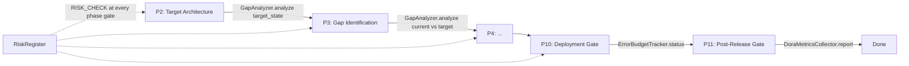

# DevSquad V4.4.0 Architecture — P0-P3 Enhancement (5 New Modules)

> **Document Type**: Architecture Design Document
> **Version**: V4.4.0
> **Predecessor**: V4.3.2
> **Date**: 2026-07-29
> **Author**: DevSquad 7-Role Consensus
> **Status**: Approved — based on 7-Role Consensus Report (`2026-07-29_P0P3_enhancement_review.md`)
> **Related Docs**:
> - [V4.4.0 PRD](../prd/V4.4.0_PRD.md)
> - [V4.4.0 Test Plan](../testing/V4.4.0_TEST_PLAN.md)
> - [V4.4.0 Roadmap](../planning/V4.4.0_ROADMAP.md)
> - [P0-P3 Enhancement Review](../analysis/2026-07-29_P0P3_enhancement_review.md)

---

## 1. Architecture Overview

### 1.1 Design Principles

| Principle | Source | Realization |
|-----------|--------|-------------|
| Additive only | 7/7 consensus | 5 new modules in `scripts/collaboration/`; no existing public API changed |
| Single Responsibility | SRP (project memory) | Each module owns one domain (risk / viewpoint / budget / gap / DORA) |
| Anti-ghost hard constraint | AG-1..AG-6 | Module-level `_call_counter` + dispatch hook auto-trigger + CI gate |
| Document-first | Iron Rule 1 | This document precedes any V4.4.0 code |
| Graceful degradation | DevSquad convention | Every integration point degrades to a no-op if the new module is absent |

### 1.2 Module Placement in DevSquad

```
┌──────────────────────────────────────────────────────────────────────────┐
│                          DevSquad V4.4.0                                  │
│                     (5 new modules highlighted)                           │
├──────────────────────────────────────────────────────────────────────────┤
│                                                                          │
│  ┌─────────────────────────────┐   ┌──────────────────────────────┐     │
│  │  User Access Layer          │   │  Dashboard (Streamlit)        │     │
│  │  CLI / API / Skill          │   │  + Error Budget panel [NEW]   │     │
│  │                             │   │  + DORA Metrics panel  [NEW]  │     │
│  └──────────────┬──────────────┘   └──────────────┬───────────────┘     │
│                 │                                  │                     │
│                 ▼                                  ▼                     │
│  ┌──────────────────────────────────────────────────────────────────┐   │
│  │            Business Logic Layer (Core Engine)                     │   │
│  │                                                                   │   │
│  │  ┌────────────────┐  ┌────────────────┐  ┌────────────────┐      │   │
│  │  │ MultiAgent     │  │ ConsensusEngine│  │ UnifiedGate    │      │   │
│  │  │ Dispatcher     │──│  + viewpoint   │  │ Engine         │      │   │
│  │  │                │  │  arbitration   │  │ + RISK_CHECK   │      │   │
│  │  │                │  │  [NEW]         │  │ + P10 budget   │      │   │
│  │  │                │  │                │  │ + P11 DORA     │      │   │
│  │  └────────┬───────┘  └────────┬───────┘  └────────┬───────┘      │   │
│  │           │                   │                   │               │   │
│  │           ▼                   ▼                   ▼               │   │
│  │  ┌────────────────┐  ┌────────────────┐  ┌────────────────┐      │   │
│  │  │ WorkflowEngine │  │ PromptAssembler│  │ LoopScheduler  │      │   │
│  │  │ + phase risk   │  │ + viewpoint    │  │ + gap-based    │      │   │
│  │  │   check [NEW]  │  │   injection    │  │   CONTINUE     │      │   │
│  │  │                │  │   [NEW]        │  │   [NEW]        │      │   │
│  │  └────────┬───────┘  └────────┬───────┘  └────────┬───────┘      │   │
│  │           │                   │                   │               │   │
│  │           ▼                   ▼                   ▼               │   │
│  │  ┌─────────────────────────────────────────────────────────────┐ │   │
│  │  │              V4.4.0 New Modules (5)                          │ │   │
│  │  │                                                              │ │   │
│  │  │  risk_register.py          viewpoint_registry.py            │ │   │
│  │  │  error_budget_tracker.py    gap_analyzer.py                 │ │   │
│  │  │  dora_metrics_collector.py                                  │ │   │
│  │  └─────────────────────────────────────────────────────────────┘ │ │   │
│  │                                                                   │   │
│  └───────────────────────────────────────────────────────────────────┘ │
│                                                                          │
│  ┌──────────────────────────────────────────────────────────────────┐   │
│  │            Data Persistence Layer                                 │   │
│  │  SQLite (history) + YAML (config) + Checkpoint (lifecycle)        │   │
│  │  + risk_register.json [NEW]  + error_budget.json [NEW]            │   │
│  │  + gap_state.json [NEW]                                           │   │
│  └──────────────────────────────────────────────────────────────────┘   │
└──────────────────────────────────────────────────────────────────────────┘
```

---

## 2. Module Design

### 2.1 Risk Register — `scripts/collaboration/risk_register.py`

#### 2.1.1 Class Diagram

```
┌─────────────────────────────────────────────────┐
│                  RiskItem (dataclass)            │
├─────────────────────────────────────────────────┤
│ - id: str                                        │
│ - description: str                               │
│ - probability: float  (0.0-1.0)                  │
│ - impact: float        (0.0-1.0)                 │
│ - response_strategy: ResponseStrategy            │
│ - owner: str                                     │
│ - status: RiskStatus                             │
│ - category: str                                  │
├─────────────────────────────────────────────────┤
│ + exposure: float  (property: p × i)             │
└─────────────────────────────────────────────────┘
                       ▲
                       │ 0..*
                       │
┌─────────────────────────────────────────────────┐
│                RiskRegister                      │
├─────────────────────────────────────────────────┤
│ - _items: dict[str, RiskItem]                    │
│ - _call_counter: int  (module-level, anti-ghost) │
├─────────────────────────────────────────────────┤
│ + add(description, probability, impact,          │
│        category, owner) -> RiskItem              │
│ + assess(risk_id, votes: dict[str, tuple])       │
│        -> RiskItem                               │
│ + mitigate(risk_id, strategy, owner, plan)       │
│        -> RiskItem                               │
│ + track(risk_id, status) -> RiskItem             │
│ + query(status?, category?) -> list[RiskItem]    │
│ + export_markdown() -> str                       │
└─────────────────────────────────────────────────┘
```

#### 2.1.2 Interfaces
- Public API: `RiskRegister` (see PRD §3.1.3)
- Enums: `ResponseStrategy` (4 values), `RiskStatus` (3 values)
- Persistence: optional JSON dump to `data/risk_register.json` (configurable)

#### 2.1.3 Dependencies
- `dataclasses` (stdlib)
- `enum` (stdlib)
- `hashlib` (for stable `id`)
- No external dependencies; no DevSquad internal dependencies (leaf module)

### 2.2 Viewpoint Registry — `scripts/collaboration/viewpoint_registry.py`

#### 2.2.1 Class Diagram

```
┌─────────────────────────────────────────────────┐
│                  Viewpoint (dataclass)           │
├─────────────────────────────────────────────────┤
│ - name: str                                      │
│ - concerns: list[str]                            │
│ - model_elements: list[str]                      │
│ - stakeholders: list[str]                        │
│ - role_id: str                                   │
└─────────────────────────────────────────────────┘
                       ▲
                       │ 1..7
                       │
┌─────────────────────────────────────────────────┐
│              ViewpointRegistry                   │
├─────────────────────────────────────────────────┤
│ - _viewpoints: dict[str, Viewpoint]  (7 entries) │
│ - _call_counter: int                             │
├─────────────────────────────────────────────────┤
│ + get(role_id) -> Viewpoint                      │
│ + all() -> list[Viewpoint]                       │
│ + check_consistency(outputs) -> list[Violation]  │
│ + is_orthogonal(role_a, role_b) -> bool          │
└─────────────────────────────────────────────────┘

┌─────────────────────────────────────────────────┐
│          ConsistencyViolation (dataclass)        │
├─────────────────────────────────────────────────┤
│ - role_a: str                                    │
│ - role_b: str                                    │
│ - shared_element: str                            │
│ - contradiction: str                             │
└─────────────────────────────────────────────────┘
```

#### 2.2.2 Interfaces
- Public API: `ViewpointRegistry` (see PRD §3.2.3)
- The 7 viewpoints are constructed at module load time (static config)

#### 2.2.3 Dependencies
- `dataclasses` (stdlib)
- No external dependencies; consumed by `ConsensusEngine` and `PromptAssembler`

### 2.3 Error Budget Tracker — `scripts/collaboration/error_budget_tracker.py`

#### 2.3.1 Class Diagram

```
┌─────────────────────────────────────────────────┐
│                ErrorBudget (dataclass)           │
├─────────────────────────────────────────────────┤
│ - slo_target: float                              │
│ - window_days: int                               │
│ - budget_remaining: float  (0.0-1.0)             │
│ - burn_rate: float                               │
│ - status: BudgetStatus                           │
└─────────────────────────────────────────────────┘
                       ▲
                       │ 1..*
                       │
┌─────────────────────────────────────────────────┐
│             ErrorBudgetTracker                   │
├─────────────────────────────────────────────────┤
│ - _budgets: dict[str, ErrorBudget]               │
│ - _call_counter: int                             │
├─────────────────────────────────────────────────┤
│ + calculate(slo_target, window_days,             │
│             observed_errors, total_events)       │
│        -> ErrorBudget                             │
│ + consume(budget_id, error_count) -> ErrorBudget │
│ + reset(budget_id) -> ErrorBudget                │
│ + status(budget_id) -> BudgetStatus              │
└─────────────────────────────────────────────────┘
```

#### 2.3.2 Dependencies
- `dataclasses`, `enum`, `datetime` (stdlib)
- Consumed by `UnifiedGateEngine` P10 gate and `Dashboard`

### 2.4 Gap Analyzer — `scripts/collaboration/gap_analyzer.py`

#### 2.4.1 Class Diagram

```
┌─────────────────────────────────────────────────┐
│                   Gap (dataclass)                │
├─────────────────────────────────────────────────┤
│ - id: str                                        │
│ - current_state: str                             │
│ - target_state: str                              │
│ - work_package: str                              │
│ - priority: GapPriority                          │
│ - effort: float          (person-days)           │
│ - closure_delta: float   (last loop)             │
└─────────────────────────────────────────────────┘
                       ▲
                       │ 0..*
                       │
┌─────────────────────────────────────────────────┐
│                  GapAnalyzer                     │
├─────────────────────────────────────────────────┤
│ - _gaps: dict[str, Gap]                          │
│ - _call_counter: int                             │
├─────────────────────────────────────────────────┤
│ + analyze(current_state, target_state)           │
│        -> list[Gap]                              │
│ + prioritize(gaps) -> list[Gap]                  │
│ + generate_roadmap(gaps) -> str                  │
│ + track(gap_id, closure_delta) -> Gap            │
└─────────────────────────────────────────────────┘
```

#### 2.4.2 Dependencies
- `dataclasses`, `enum`, `hashlib` (stdlib)
- Consumed by `WorkflowEngine` (P2/P3 phases) and `LoopScheduler`

### 2.5 DORA Metrics Collector — `scripts/collaboration/dora_metrics_collector.py`

#### 2.5.1 Class Diagram

```
┌─────────────────────────────────────────────────┐
│                DoraMetrics (dataclass)           │
├─────────────────────────────────────────────────┤
│ - deployment_frequency: float  (deploys/day)    │
│ - lead_time: float             (hours)           │
│ - change_failure_rate: float   (0.0-1.0)         │
│ - mttr: float                  (hours)           │
├─────────────────────────────────────────────────┤
│ + rating(metric) -> str  (elite/high/med/low)   │
└─────────────────────────────────────────────────┘
                       ▲
                       │
┌─────────────────────────────────────────────────┐
│             DoraMetricsCollector                 │
├─────────────────────────────────────────────────┤
│ - _call_counter: int                             │
│ - _last_metrics: DoraMetrics | None              │
├─────────────────────────────────────────────────┤
│ + collect_from_git(repo_path, window_days)       │
│        -> DoraMetrics                            │
│ + collect_from_dispatch(dispatch_logs,           │
│                        window_days)              │
│        -> DoraMetrics                            │
│ + report() -> str                                │
└─────────────────────────────────────────────────┘
```

#### 2.5.2 Dependencies
- `dataclasses`, `subprocess`, `datetime`, `logging` (stdlib)
- Consumed by `UnifiedGateEngine` P11 gate and `Dashboard`
- External: `git` CLI (graceful degradation if unavailable)

---

## 3. Integration Design

### 3.1 With `UnifiedGateEngine`

#### 3.1.1 New `GateType.RISK_CHECK` (P0-1)

```python
# In unified_gate_engine.py (enum extension — backward compatible)
class GateType(Enum):
    # ... existing 6 values ...
    RISK_CHECK = "risk_check"  # V4.4.0 NEW
```

The `_check_risk` handler queries `RiskRegister.query(status=OPEN)` and adds risks with exposure ≥ 0.36 to `critical_issues`. The phase-transition gate then requires explicit acknowledgement of these risks.

```python
# Pseudo-code for the new handler
def _check_risk(self, context: dict) -> UnifiedGateResult:
    register: RiskRegister = context.get("risk_register")
    if register is None:
        # Graceful degradation: no register, no risk gate
        return UnifiedGateResult(passed=True, gate_type=GateType.RISK_CHECK, ...)
    blocking = [r for r in register.query(status="open") if r.exposure >= 0.36]
    return UnifiedGateResult(
        passed=not blocking,
        gate_type=GateType.RISK_CHECK,
        verdict="REJECT" if blocking else "APPROVE",
        critical_issues=[{"risk_id": r.id, "exposure": r.exposure} for r in blocking],
    )
```

#### 3.1.2 P10 Deployment Gate — Error Budget (P1-1)

The existing P10 compliance check (`deployment_compliance_checker.py`) is extended with a budget probe. If `ErrorBudgetTracker.status(budget_id) == EXHAUSTED` and the deployment is a feature (not a bugfix), the P10 gate returns REJECT.

#### 3.1.3 P11 Gate — DORA Change Failure Rate (P2-1)

A new P11 sub-check queries `DoraMetricsCollector.report()`. If `change_failure_rate > 0.15`, the P11 gate returns CONDITIONAL with suggestion `"trigger architecture review"`.

### 3.2 With `ConsensusEngine` (P0-2)

The `ConsensusEngine.reach_consensus()` method is extended with a post-consensus step. When the outcome is `SPLIT`, the engine queries `ViewpointRegistry.is_orthogonal(role_a, role_b)` for the two leading factions:

```python
# Pseudo-code for the SPLIT arbitration extension
if record.outcome == DecisionOutcome.SPLIT:
    a, b = leading_factions(record)
    if viewpoint_registry.is_orthogonal(a, b):
        # Both outputs address different concerns — keep both
        record.outcome = DecisionOutcome.APPROVED
        record.warnings.append("SPLIT resolved by viewpoint orthogonality")
    else:
        # Non-orthogonal — escalate
        record.outcome = DecisionOutcome.ESCALATED
```

### 3.3 With `WorkflowEngine` (P0-1 + P1-2)

`WorkflowEngine` invokes the new modules at two lifecycle phases:



### 3.4 With `PromptAssembler` (P0-2)

`PromptAssembler` is extended with a viewpoint-injection step. Before assembling the final prompt, it queries `ViewpointRegistry.get(role_id)` and appends a `## Viewpoint` section containing the role's `concerns` and `model_elements`.

```python
# Pseudo-code for the prompt injection
viewpoint = viewpoint_registry.get(role_id)
prompt += f"\n## Viewpoint: {viewpoint.name}\n"
prompt += f"Concerns: {', '.join(viewpoint.concerns)}\n"
prompt += f"Model elements: {', '.join(viewpoint.model_elements)}\n"
```

### 3.5 With `LoopScheduler` (P1-2)

`LoopScheduler` queries `GapAnalyzer.track()` at the end of each loop. If the sum of `closure_delta` across all gaps is ≤ 0 (no progress or regression), the scheduler decides STOP instead of CONTINUE.

### 3.6 With `Dashboard` (P1-1 + P2-1)

Two new read-only panels are added to `scripts/dashboard/`:

| Panel | Module | Data Source |
|-------|--------|-------------|
| Error Budget | `v44_panels.py` [NEW] | `ErrorBudgetTracker.status()` |
| DORA Metrics | `v44_panels.py` [NEW] | `DoraMetricsCollector.report()` |

Both panels are read-only (no UI design task — they render numeric cards + a progress bar).

### 3.7 With `dispatch_hooks.py` (Anti-Ghost AG-2)

`dispatch_hooks.py` is extended with 5 auto-trigger hooks that call the new modules' public methods during a real `dispatch()`:

| Hook Point | Module | Method Called |
|------------|--------|---------------|
| Post-consensus | `risk_register` | `assess(risk_id, votes)` |
| Pre-prompt-assembly | `viewpoint_registry` | `get(role_id)` |
| Post-incident | `error_budget_tracker` | `consume(budget_id, error_count)` |
| P2/P3 phase entry | `gap_analyzer` | `analyze(current, target)` |
| Post-deploy | `dora_metrics_collector` | `collect_from_dispatch(logs)` |

Each hook is guarded by `try/except` so a failure in one new module never breaks the existing dispatch flow.

---

## 4. Data Flow Diagrams

### 4.1 Risk Register Data Flow

```
7 Roles (votes)
    │
    ▼
dispatch_hooks.post_consensus
    │
    ▼
RiskRegister.assess(risk_id, votes) ──► RiskItem (updated p/i)
    │
    ▼
RiskRegister.query(status=OPEN)
    │
    ├──► UnifiedGateEngine._check_risk ──► UnifiedGateResult
    │                                   (passed=False if exposure ≥ 0.36)
    │
    └──► ReportFormatter ──► "Risk Management" Markdown section
```

### 4.2 Viewpoint Registry Data Flow

```
PromptAssembler
    │
    ▼
ViewpointRegistry.get(role_id) ──► Viewpoint
    │
    ▼
Prompt += viewpoint section ──► Worker (role-specific output)
    │
    ▼
ConsensusEngine.reach_consensus()
    │
    ├── outcome == APPROVED ──► done
    │
    ├── outcome == SPLIT ──► is_orthogonal(a, b)?
    │       ├── True  ──► APPROVED (both kept)
    │       └── False ──► ESCALATED
    │
    └── check_consistency(outputs) ──► "Viewpoint Consistency" subsection
```

### 4.3 Error Budget Data Flow

```
Incident (during dispatch)
    │
    ▼
dispatch_hooks.post_incident
    │
    ▼
ErrorBudgetTracker.consume(budget_id, error_count) ──► ErrorBudget (updated)
    │
    ├──► UnifiedGateEngine P10 gate
    │        (REJECT feature deploy if status == EXHAUSTED)
    │
    └──► Dashboard "Error Budget" panel
             (progress bar + burn_rate + status badge)
```

### 4.4 Gap Analyzer Data Flow

```
P2 phase: target architecture ──► GapAnalyzer.analyze(target_state)
P3 phase: current architecture ──► GapAnalyzer.analyze(current vs target)
    │
    ▼
list[Gap] ──► prioritize() ──► generate_roadmap() ──► "Gap Analysis" section
    │
    ▼
LoopScheduler (end of loop)
    │
    ▼
GapAnalyzer.track(gap_id, closure_delta)
    │
    ├── sum(delta) > 0 ──► CONTINUE
    └── sum(delta) ≤ 0 ──► STOP
```

### 4.5 DORA Metrics Data Flow

```
git log (repo)               dispatch_audit logs
    │                              │
    ▼                              ▼
collect_from_git()          collect_from_dispatch()
    │                              │
    └──────────┬───────────────────┘
               ▼
         DoraMetrics
               │
               ├──► UnifiedGateEngine P11 gate
               │        (CONDITIONAL if change_failure_rate > 0.15)
               │
               ├──► Dashboard "DORA Metrics" panel (4 numeric cards)
               │
               └──► report() ──► "Delivery Performance" Markdown section
```

---

## 5. Technical Decisions

| # | Decision | Alternatives Considered | Rationale |
|---|----------|------------------------|-----------|
| TD-1 | Extend `GateType` enum with `RISK_CHECK` | (a) New standalone `RiskGateEngine`, (b) Reuse `QUALITY_THRESHOLD` | Enum extension is backward compatible; a new engine would duplicate `UnifiedGateEngine` infra; `QUALITY_THRESHOLD` semantics do not match risk |
| TD-2 | 7-role voting for risk assessment | (a) Architect-only assessment, (b) Unweighted mean | 7-role voting matches DevSquad's consensus model; weighted mean (Architect 3.0) respects role authority; avoids single-role bias |
| TD-3 | Viewpoint orthogonality = no shared concerns | (a) Jaccard similarity threshold, (b) LLM-based semantic overlap | Boolean orthogonality is deterministic and testable; Jaccard/LLM add complexity without V4.4.0 value |
| TD-4 | Error budget gates P10 (not P11) | (a) Gate P11, (b) Gate every phase | P10 is the deployment gate (correct place to block feature deploys); P11 is post-release (too late); gating every phase is over-blocking |
| TD-5 | Gap Analyzer feeds `LoopScheduler` (not `WorkflowEngine`) | (a) Feed `WorkflowEngine` directly | `LoopScheduler` owns the CONTINUE/STOP decision; `WorkflowEngine` owns phase transitions; gap-closure is a loop-level signal, not a phase-level one |
| TD-6 | DORA collected from both git and dispatch | (a) Git only, (b) Dispatch only | Git covers human-driven deploys; dispatch covers AI-driven deploys; both needed for full picture |
| TD-7 | Dashboard panels are read-only | (a) Interactive config panels | V4.4.0 panels are observability surfaces; interactive config deferred to V4.5.0 (UI role overruled for now) |
| TD-8 | Module-level `_call_counter` (not instance-level) | (a) Instance-level counter | Module-level survives across instances; `check_module_activation.py` can import the module and read the counter without holding a reference |
| TD-9 | Hooks are `try/except`-guarded | (a) Fail-fast | Graceful degradation is a DevSquad convention; a new module's bug must not break existing dispatch |
| TD-10 | Persistence is JSON (not SQLite) | (a) SQLite, (b) In-memory only | JSON is human-readable and diff-friendly; SQLite is overkill for V4.4.0 volume; in-memory loses state across restarts |

---

## 6. Security Considerations

| # | Consideration | Mitigation |
|---|---------------|------------|
| S-1 | Risk descriptions may contain sensitive context | `export_markdown()` runs through `secret_patterns.py` masker before output |
| S-2 | DORA git parsing may expose commit author PII | `report()` aggregates only; no author names in the report |
| S-3 | Error budget consumption may be spoofed | `consume()` requires `budget_id` (issued by `calculate()`); audit-logged via `audit_logger.py` |
| S-4 | Viewpoint injection may leak cross-role context | Each viewpoint is role-scoped; no cross-role data in the injected spec |
| S-5 | Gap analysis may reference internal architecture secrets | `generate_roadmap()` output is reviewable before publish (advisory, not auto-published) |

---

## 7. Performance Budget

| Module | Operation | Budget | Notes |
|--------|-----------|--------|-------|
| Risk Register | `assess()` with 7 votes | < 5ms | Weighted mean over 7 floats |
| Risk Register | `export_markdown()` (100 risks) | < 50ms | String formatting |
| Viewpoint Registry | `is_orthogonal()` | < 1ms | Set intersection |
| Viewpoint Registry | `check_consistency()` (7 outputs) | < 20ms | Pairwise comparison |
| Error Budget Tracker | `calculate()` | < 1ms | Arithmetic |
| Gap Analyzer | `analyze()` (100 capabilities) | < 10ms | Dict diff |
| Gap Analyzer | `generate_roadmap()` (50 gaps) | < 30ms | String formatting |
| DORA Collector | `collect_from_git()` (10k commits) | < 5s | `git log` subprocess + parse |
| DORA Collector | `collect_from_dispatch()` (1k logs) | < 100ms | In-memory filter |

---

## 8. Anti-Ghost Architecture

The anti-ghost mechanism is a first-class architectural concern, not an afterthought:

```
┌─────────────────────────────────────────────────────────────┐
│                   Anti-Ghost Architecture                    │
├─────────────────────────────────────────────────────────────┤
│                                                             │
│  ┌──────────────────┐   ┌──────────────────┐               │
│  │  Module-level    │   │  dispatch_hooks  │               │
│  │  _call_counter   │◄──│  auto-trigger    │               │
│  │  (per module)    │   │  (5 hooks)       │               │
│  └────────┬─────────┘   └────────┬─────────┘               │
│           │                      │                          │
│           ▼                      ▼                          │
│  ┌──────────────────────────────────────────────────────┐  │
│  │  check_module_activation.py (CI gate)                │  │
│  │  - Reads each module's _call_counter                 │  │
│  │  - Fails build if counter == 0 over 7-day window     │  │
│  └──────────────────────────────────────────────────────┘  │
│                                                             │
│  ┌──────────────────────────────────────────────────────┐  │
│  │  E2E test: full dispatch() increments all 5 counters │  │
│  └──────────────────────────────────────────────────────┘  │
│                                                             │
└─────────────────────────────────────────────────────────────┘
```

---

## 9. Change History

| Date | Version | Change | Author |
|------|---------|--------|--------|
| 2026-07-29 | v1.0 | Initial creation; 5 module designs; 6 integration points; 5 data flow diagrams; 10 technical decisions; anti-ghost architecture | DevSquad 7-Role Consensus |

---

> **Document Status**: Approved
> **Next Step**: V4.4.0 Test Plan → Roadmap → V4.3.3 xfail skeleton → V4.4.0 implementation
