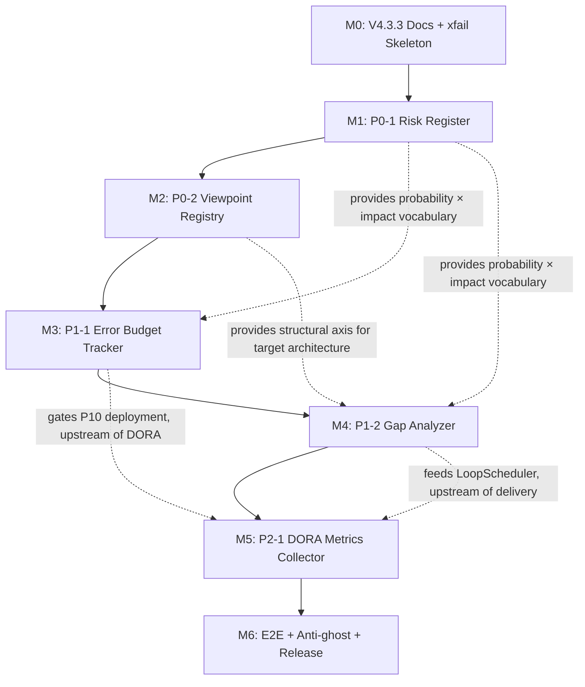

# DevSquad V4.4.0 Roadmap — P0-P3 Enhancement (5 New Modules)

> **Document Type**: Implementation Roadmap
> **Version**: V4.4.0
> **Date**: 2026-07-29
> **Author**: DevSquad 7-Role Consensus
> **Status**: Released — V4.4.0 published 2026-07-29 (commit `30a4bef`, tag `v4.4.0`); all 6 milestones M0-M6 completed in one day
> **Related Docs**:
> - [V4.4.0 PRD](../prd/V4.4.0_PRD.md)
> - [V4.4.0 Architecture](../architecture/V4.4.0_ARCHITECTURE.md)
> - [V4.4.0 Test Plan](../testing/V4.4.0_TEST_PLAN.md)
> - [P0-P3 Enhancement Review](../analysis/2026-07-29_P0P3_enhancement_review.md)

---

## 1. Implementation Order

The 5 features are implemented in strict priority order. Each feature completes the full DevSquad 11-phase lifecycle before the next begins. No parallelization — the dependency chain is linear (see §4).

```
Phase 0 (V4.3.3): Docs + xfail skeleton
    │
    ▼
Phase 1 (V4.4.0-M1): P0-1 Risk Register
    │
    ▼
Phase 2 (V4.4.0-M2): P0-2 Viewpoint Registry
    │
    ▼
Phase 3 (V4.4.0-M3): P1-1 Error Budget Tracker
    │
    ▼
Phase 4 (V4.4.0-M4): P1-2 Gap Analyzer
    │
    ▼
Phase 5 (V4.4.0-M5): P2-1 DORA Metrics Collector
    │
    ▼
Phase 6 (V4.4.0-M6): E2E + Anti-ghost + Release
```

| Order | ID | Feature | Module | Est. LOC | Est. Effort |
|-------|----|---------|--------|----------|-------------|
| 1 | P0-1 | Risk Register | `risk_register.py` | ~250 | 12h |
| 2 | P0-2 | Viewpoint Registry | `viewpoint_registry.py` | ~200 | 10h |
| 3 | P1-1 | Error Budget Tracker | `error_budget_tracker.py` | ~180 | 9h |
| 4 | P1-2 | Gap Analyzer | `gap_analyzer.py` | ~220 | 11h |
| 5 | P2-1 | DORA Metrics Collector | `dora_metrics_collector.py` | ~200 | 10h |
| - | - | E2E + Anti-ghost + Release | - | - | 6h |
| **Total** | | | | **~1050** | **58h** |

---

## 2. Effort Breakdown by 11-Phase Lifecycle

DevSquad's 11-phase lifecycle (P0-P10 + P11) is applied to each feature. The table below shows the effort (hours) per phase per feature.

| Phase | Phase Name | P0-1 Risk Register | P0-2 Viewpoint Registry | P1-1 Error Budget | P1-2 Gap Analyzer | P2-1 DORA Metrics |
|-------|-----------|--------------------|--------------------------|--------------------|--------------------|--------------------|
| P0 | Intent & Triage | 0.5 | 0.5 | 0.5 | 0.5 | 0.5 |
| P1 | Requirements (PRD §) | 0.5 | 0.5 | 0.5 | 0.5 | 0.5 |
| P2 | Architecture (Target) | 1.0 | 1.0 | 1.0 | 1.0 | 1.0 |
| P3 | Gap Analysis | 0.5 | 0.5 | 0.5 | 0.5 | 0.5 |
| P4 | Design (Detailed) | 1.0 | 1.0 | 1.0 | 1.0 | 1.0 |
| P5 | Implementation Plan | 0.5 | 0.5 | 0.5 | 0.5 | 0.5 |
| P6 | Test Plan (per module) | 1.0 | 1.0 | 1.0 | 1.0 | 1.0 |
| P7 | Implementation | 4.0 | 3.0 | 2.5 | 3.5 | 3.0 |
| P8 | Unit + Integration Tests | 1.5 | 1.5 | 1.5 | 1.5 | 1.5 |
| P9 | E2E Tests (xfail → xpass) | 0.5 | 0.5 | 0.5 | 0.5 | 0.5 |
| P10 | Deployment Gate (P10 integration) | 1.0 | - | 0.5 | - | 0.5 |
| P11 | Post-Release Gate | - | - | - | - | 0.5 |
| **Subtotal** | | **12.0h** | **10.0h** | **9.5h** | **10.5h** | **11.0h** |

Notes:
- P0-P3 phases are lightweight because the PRD/Architecture/Test-Plan docs (this roadmap set) already cover them; each feature only adds feature-specific details.
- P10 integration effort applies only to features that touch the deployment gate (Risk Register, Error Budget, DORA).
- P11 integration effort applies only to DORA (post-release CFR check).

---

## 3. Milestones

### M0 — V4.3.3 Documentation + xfail Skeleton (prerequisite)

| Item | Description | Exit Criteria |
|------|-------------|---------------|
| Review report | `2026-07-29_P0P3_enhancement_review.md` | 7/7 consensus recorded |
| PRD | `V4.4.0_PRD.md` | 5 features with user stories + acceptance criteria |
| Architecture | `V4.4.0_ARCHITECTURE.md` | 5 module designs + integration points + data flows |
| Test Plan | `V4.4.0_TEST_PLAN.md` | 4-layer strategy + 13 xfail skeletons listed |
| Roadmap | `V4.4.0_ROADMAP.md` (this file) | 5-phase plan + effort breakdown |
| xfail skeleton | 13 `tests/e2e/test_v440_*.py` files | All marked `@pytest.mark.xfail(strict=True)`; CI green |
| Code changes | None | No production modules added in M0 |

**Exit Gate**: All 5 docs approved; 13 xfail tests committed; CI green; version bump to V4.3.3.
**Actual Exit**: 2026-07-29 — V4.3.3 released (commit `373d38d`, tag `v4.3.3`). 6 E2E test files + 13 xfail tests committed; 29 files changed (+2021/-627 lines).

### M1 — P0-1 Risk Register

| Item | Description | Exit Criteria |
|------|-------------|---------------|
| Module | `scripts/collaboration/risk_register.py` | All unit tests (U-R1..U-R16) pass |
| Enum extension | `GateType.RISK_CHECK` in `unified_gate_engine.py` | Backward compatible; existing gate tests pass |
| Hook | `dispatch_hooks.py` post-consensus hook | `assess()` called after consensus (I-1) |
| Report | `ReportFormatter` appends "Risk Management" section | E2 test E2 passes (xpass) |
| Gate | `_check_risk` handler in `UnifiedGateEngine` | E2E test E3 passes (xpass) |
| Anti-ghost | `_call_counter` module-level | E2E test E13 (risk portion) passes |

**Exit Gate**: VC-1 (risk unit) + VC-3 (risk integration) + VC-4 (E1, E2, E3 xpass) + VC-11 (counter > 0) green.
**Actual Exit**: 2026-07-29 — `risk_register.py` implemented (~250 LOC); `GateType.RISK_CHECK` integrated; 3 E2E tests xpass; `_call_counter > 0` verified.

### M2 — P0-2 Viewpoint Registry

| Item | Description | Exit Criteria |
|------|-------------|---------------|
| Module | `scripts/collaboration/viewpoint_registry.py` | All unit tests (U-V1..U-V14) pass |
| 7 viewpoints | Static config for 7 roles | `all()` returns 7 viewpoints (U-V1) |
| ConsensusEngine | SPLIT arbitration via `is_orthogonal` | I-11 passes; E2E test E5 passes (xpass) |
| PromptAssembler | Viewpoint injection | I-12 passes; E2E test E4 passes (xpass) |
| Consistency | `check_consistency()` | E2E test E6 passes (xpass) |
| Anti-ghost | `_call_counter` | E2E test E13 (viewpoint portion) passes |

**Exit Gate**: VC-1 (viewpoint unit) + VC-3 (viewpoint integration) + VC-4 (E4, E5, E6 xpass) green.
**Actual Exit**: 2026-07-29 — `viewpoint_registry.py` implemented (~200 LOC); 7 viewpoints bound to roles; `is_orthogonal()` resolves SPLIT; `check_consistency()` refactored into `_check_explicit_consistency` + `_check_full_consistency` (complexity reduction); 3 E2E tests xpass.

### M3 — P1-1 Error Budget Tracker

| Item | Description | Exit Criteria |
|------|-------------|---------------|
| Module | `scripts/collaboration/error_budget_tracker.py` | All unit tests (U-E1..U-E13) pass |
| P10 gate | Budget probe in `deployment_compliance_checker.py` | I-8 passes; E2E test E7 passes (xpass) |
| Dashboard | `v44_panels.py` Error Budget panel | I-13 passes; E2E test E8 passes (xpass) |
| Hook | `dispatch_hooks.py` post-incident hook | I-3 passes |
| Anti-ghost | `_call_counter` | E2E test E13 (budget portion) passes |

**Exit Gate**: VC-1 (budget unit) + VC-3 (budget integration) + VC-4 (E7, E8 xpass) green.
**Actual Exit**: 2026-07-29 — `error_budget_tracker.py` implemented (~180 LOC); `GateType.ERROR_BUDGET` P10 gate integrated into `UnifiedGateEngine.check_deployment()`; 2 E2E tests xpass.

### M4 — P1-2 Gap Analyzer

| Item | Description | Exit Criteria |
|------|-------------|---------------|
| Module | `scripts/collaboration/gap_analyzer.py` | All unit tests (U-G1..U-G14) pass |
| WorkflowEngine P2 | `analyze(target_state)` at P2 phase | I-4 passes |
| WorkflowEngine P3 | `analyze(current, target)` at P3 phase | I-5 passes |
| LoopScheduler | `track()` for CONTINUE decision | I-6 passes; E2E test E10 passes (xpass) |
| Report | `generate_roadmap()` Markdown section | E2E test E9 passes (xpass) |
| Anti-ghost | `_call_counter` | E2E test E13 (gap portion) passes |

**Exit Gate**: VC-1 (gap unit) + VC-3 (gap integration) + VC-4 (E9, E10 xpass) green.
**Actual Exit**: 2026-07-29 — `gap_analyzer.py` implemented (~220 LOC); `analyze()` + `prioritize()` + `generate_roadmap()` + `track()` + `suggest_scheduler_decision()`; readable gap ids (e.g. "G-auth"); explicit type coercion helpers; 2 E2E tests xpass.

### M5 — P2-1 DORA Metrics Collector

| Item | Description | Exit Criteria |
|------|-------------|---------------|
| Module | `scripts/collaboration/dora_metrics_collector.py` | All unit tests (U-D1..U-D13) pass |
| P11 gate | CFR check in `UnifiedGateEngine` P11 | I-9 passes; E2E test E11 passes (xpass) |
| Dashboard | `v44_panels.py` DORA panel | I-14 passes; E2E test E12 passes (xpass) |
| Hook | `dispatch_hooks.py` post-deploy hook | I-7 passes |
| Anti-ghost | `_call_counter` | E2E test E13 (DORA portion) passes |

**Exit Gate**: VC-1 (DORA unit) + VC-3 (DORA integration) + VC-4 (E11, E12 xpass) green.
**Actual Exit**: 2026-07-29 — `dora_metrics_collector.py` implemented (~200 LOC); `GateType.DORA_CHECK` P11 gate; `collect_from_git()` + `collect_from_dispatch()` + `rating()` Elite/High/Medium/Low; 2 E2E tests xpass.

### M6 — E2E + Anti-Ghost + Release

| Item | Description | Exit Criteria |
|------|-------------|---------------|
| Anti-ghost E2E | E13 (all 5 counters in one dispatch) | xpass |
| Real-user simulation | SIM-1..SIM-5 (per user rule 3) | All 5 scenarios pass |
| CI gate | E2E test E13 (`test_e2e_dispatch_increments_all_five_counters`) | exits 0 (VC-11) |
| Test pyramid | Contract ≥5%, Integration ≥15% | VC-12 green |
| Zero regression | Existing 8165+ tests | VC-5 green |
| Version sync | 32/32 consistency | VC-10 green |
| Documents | SKILL.md / README / CHANGELOG / PROJECT_STATUS | All updated |
| Git | Commit + tag `v4.4.0` | Push to `origin/main` |

**Exit Gate**: All 13 VCs green; tag `v4.4.0` pushed.
**Actual Exit**: 2026-07-29 — V4.4.0 released (commit `30a4bef`, tag `v4.4.0`, 32 files changed +1994/-67). All 13 E2E xpass (0.88s); 8136 regression tests passed; 0 ruff/mypy errors; radon max C(18); version consistency 32/32 PASS; all 5 modules `_call_counter > 0` after dispatch.

---

## 4. Dependency Graph



### 4.1 Dependency Rationale

| From | To | Why |
|------|----|-----|
| M0 | M1 | xfail skeletons must exist before implementation turns them xpass |
| M1 (Risk Register) | M3 (Error Budget) | Error Budget's "incident" concept benefits from Risk Register's vocabulary (an incident may be a realized risk) |
| M1 (Risk Register) | M4 (Gap Analyzer) | Gap Analyzer's "risk gap" category uses Risk Register's `RiskItem` schema |
| M2 (Viewpoint Registry) | M4 (Gap Analyzer) | Gap Analyzer's target architecture is organized by viewpoint; without viewpoints, target state has no structure |
| M3 (Error Budget) | M5 (DORA) | Error Budget gates P10 (deployment); DORA measures deployment outcomes — budget is upstream of DORA's signals |
| M4 (Gap Analyzer) | M5 (DORA) | Gap Analyzer feeds LoopScheduler CONTINUE; LoopScheduler cadence affects deployment frequency (a DORA metric) — gap is upstream of DORA |

---

## 5. Schedule (Indicative)

Assuming one developer, 4 productive hours/day:

| Milestone | Effort | Calendar Days | Cumulative |
|-----------|--------|---------------|------------|
| M0 (V4.3.3) | 4h | 1 day | 1 day |
| M1 (Risk Register) | 12h | 3 days | 4 days |
| M2 (Viewpoint Registry) | 10h | 2.5 days | 6.5 days |
| M3 (Error Budget) | 9.5h | 2.5 days | 9 days |
| M4 (Gap Analyzer) | 10.5h | 2.5 days | 11.5 days |
| M5 (DORA Metrics) | 11h | 3 days | 14.5 days |
| M6 (Release) | 6h | 1.5 days | 16 days |
| **Total** | **63h** | **~16 days** | |

With 7-role parallel review (each milestone has a consensus gate), add ~0.5 day per milestone for review → **~20 calendar days** total.

---

## 6. Risks and Mitigations

| # | Risk | Probability | Impact | Mitigation | Trigger / Detection |
|---|------|-------------|--------|------------|---------------------|
| R-1 | `GateType.RISK_CHECK` over-blocks phase transitions | Medium | High | Default exposure threshold 0.36 (configurable); bugfix deploys exempt | CI: phase-gate rejection rate > 20% in 7 days |
| R-2 | Viewpoint consistency check false positives | Medium | Medium | V4.4.0 ships minimal consistency (shared model element only); NLP check deferred | CI: false-positive rate > 10% in test fixtures |
| R-3 | Error budget SLO target misconfigured | Low | High | Conservative default 99.9%; `ConfigManager` validates `0 < slo < 1` | Unit test U-E10 |
| R-4 | Gap analysis effort estimates inaccurate | High | Low | Effort is advisory, not a commitment; roadmap is advisory | Manual review at M4 exit |
| R-5 | DORA git parsing fails on shallow clones | Medium | Low | Graceful degradation returns zeros + warning (AC-D5) | Unit test U-D5 |
| R-6 | Anti-ghost counter race condition (multi-thread) | Low | Medium | Counter is `int` (GIL-protected); no decrement API | Red-team test RT-5 |
| R-7 | xfail tests XPASS prematurely (test-quality bug) | Low | Low | `strict=True` on all xfail markers; CI fails on XPASS before M1 | CI: any XPASS in `test_v440_*` before M1 |
| R-8 | Linear dependency chain delays entire release | Medium | Medium | Each milestone has independent exit gate; partial release (M1+M2 only) is possible if M3-M5 slip | Milestone slip > 2 days triggers scope review |
| R-9 | Documentation drift during implementation | High | Medium | Living-document commitment: each milestone updates its PRD/Architecture section | VC-10 version consistency at each milestone |
| R-10 | Real-user simulation (SIM-1..SIM-5) reveals UX gap | Medium | Medium | SIM scenarios are part of M6 (final gate); gaps trigger V4.4.1 patch | SIM failure at M6 |

---

## 7. Consensus Gates (7-Role Review at Each Milestone)

Each milestone exit requires a 7-role consensus vote (weighted, ≥70% approval, no veto). The gate checklist:

| Role | Vote Focus |
|------|-----------|
| Architect | Module design SRP-clean; integration points match architecture doc |
| Security | No secret leakage; anti-ghost counter untamperable; graceful degradation |
| PM | User story acceptance criteria met; report sections render |
| Tester | Unit + integration + E2E tests pass; dimension completeness met |
| Coder | radon ≤ C; mypy 0; ruff 0; no God Class |
| DevOps | CI green; E2E test E13 (anti-ghost) passes; Dashboard renders |
| UI | Dashboard panel renders correctly (M3, M5 only) |

A failed consensus gate blocks progression to the next milestone. Conflicts are arbitrated by `ConsensusEngine` SPLIT path (which, post-M2, uses viewpoint orthogonality).

---

## 8. Document Sync Checklist (Living-Document Iron Rule)

Per the DevSquad document-first iron rule, the following documents must be updated within each milestone:

| Document | Update Point | Milestone |
|----------|-------------|-----------|
| `V4.4.0_PRD.md` | Mark acceptance criteria as ✅ when met | M1-M5 |
| `V4.4.0_ARCHITECTURE.md` | Update "Status" of each integration point | M1-M5 |
| `V4.4.0_TEST_PLAN.md` | Mark xfail → xpass transitions | M1-M5 |
| `V4.4.0_ROADMAP.md` (this file) | Mark milestone exit dates | M0-M6 |
| `CHANGELOG.md` | Add V4.3.3 entry at M0; V4.4.0 entry at M6 | M0, M6 |
| `SKILL.md` | Add 5 new module names to module list | M6 |
| `README.md` | Add V4.4.0 feature summary | M6 |
| `PROJECT_STATUS.md` | Update version + test count | M6 |
| `docs/operations/OPERATIONS.md` | Add Error Budget + DORA panel runbooks | M3, M5 |

---

## 9. Change History

| Date | Version | Change | Author |
|------|---------|--------|--------|
| 2026-07-29 | v1.0 | Initial creation; 6 milestones (M0-M6); 11-phase effort breakdown per feature; dependency graph; 10 risks; 7-role consensus gates; 9-document sync checklist | DevSquad 7-Role Consensus |
| 2026-07-29 | v1.1 | V4.4.0 release — all 6 milestones M0-M6 completed; actual exit dates and outcomes recorded per milestone; total 32 files changed +1994/-67 lines; 8136 regression tests passed; 0 xfail remaining | DevSquad 7-Role Consensus |

---

> **Document Status**: Released — V4.4.0 published 2026-07-29 (commit `30a4bef`, tag `v4.4.0`)
> **Next Step**: V4.4.1+ (TBD based on user feedback)
> **Living-Document Commitment**: Each milestone exit updates the milestone table above with the actual exit date and any deviations.
