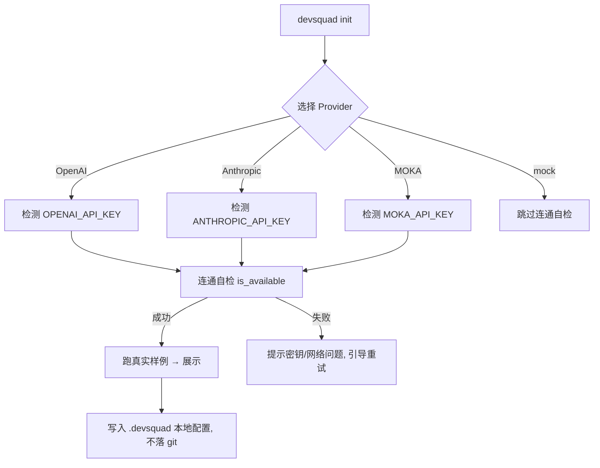

# V4.5.2 产品需求文档（PRD）— 真实 LLM 一键接通 + 性能基线

> **文档类型**: 产品需求文档 (PRD)
> **所属迭代**: V4.5.2（4.5.x 系列小步迭代第一批）
> **最后更新**: 2026-08-05
> **状态**: 📋 待门禁评审
> **对接**: [V4.4.2_ROADMAP](../planning/V4.4.2_ROADMAP.md) §4

---

## 1. 产品信息

| 产品名称 | 版本 | 负责人 | 最后更新 |
|---------|------|--------|----------|
| DevSquad | V4.5.2 | 产品经理（DevSquad 7-Role 共识） | 2026-08-05 |

---

## 2. 产品概述

### 2.1 产品背景

DevSquad 初心定位（用户 2026-08-05 澄清）是**协助 TRAE / ClaudeCode / Codex 等编程 AI，对软件开发的「框架、流程、文档、架构、质量、安全、部署」进行「管控」的工具**。

当前 DevSquad 默认运行在 **Mock 模式**——`MockBackend.generate()` 仅返回带 `[MOCK MODE]` 标记的拼接提示词，不产生真实分析与评审。作为一个**软件开发管控引擎**，它必须能对编程 AI 产出的代码做**真实的**安全检查、质量审查、架构评审并给出可交付结论。无法产出真实 LLM 结论，DevSquad 就只是演示品，无法被真正投入使用。

CLI 已具备 `--backend`、`DEVSQUAD_LLM_BACKEND` 环境变量以及 OpenAI / Anthropic / Trae backend 基础（见 [llm_backend.py](../../scripts/collaboration/llm_backend.py)、[cli.py](../../scripts/cli.py)），但存在缺口：
1. **一键接通体验**不完整：缺少 MOKA AI provider 支持、缺少统一的密钥管理与连接自检、缺少"从 mock 一键切换到真实 LLM 并验证连通"的顺畅路径。
2. **无真实 LLM 全链路 E2E**：从未在 CI 用真实 LLM 验证过 dispatch → 7 角色 → 共识 → 报告全链路，违背用户规则 3"发布前必须模拟真实用户使用"。
3. **无性能基线**：无法度量真实 LLM 及 mock 路径的性能，后续"软件管控"自动化落地无参照。

### 2.2 产品目标

- **业务目标**：让 DevSquad 真正被用于软件开发管控——一键接通真实 LLM，对编程 AI 产出做真实的安全/质量/架构评审。
- **技术目标**：统一的 LLM provider 抽象（含 MOKA），一键初始化 + 连通自检 + 全链路真实 LLM E2E；建立性能基线并在 CI 阻塞化。
- **用户目标**：使用者 5 分钟内从安装到产出真实管控结论，无需手工配置依赖细节。

### 2.3 术语定义

| 术语 | 解释 |
|------|------|
| Provider / LLM provider | 真实大模型服务商：OpenAI / Anthropic / MOKA AI / Trae 宿主 |
| 一键接通 | 通过 `devsquad init` 向导或环境变量统一配置 provider + 密钥，并自动完成连通自检 |
| 性能基线 | 各 provider + mock 路径的 dispatch 耗时 P95/P99、CPU、内存的基准快照 |
| 阻塞化 | CI 中性能回归超过阈值（>10%）即阻断 PR 合并 |

---

## 3. 核心功能

### 3.1 用户角色

| 角色 | 注册方式 | 核心权限 |
|------|----------|----------|
| DevSquad 管控使用者 | 本机安装 | 配置 provider、执行 dispatch、获取真实管控结论 |
| 编程 AI 开发者 | TRAE/Codex | 其产出被 DevSquad 审查管控（可读报告） |
| CI/DevOps | CI 集成 | 触发性能回归门禁、查看基线 |

### 3.2 功能模块

| 模块 | 功能描述 | 优先级 | 备注 |
|------|---------|--------|------|
| **LLM Provider 统一抽象** | 在现有 `LLMBackend` 基础上补齐 MOKA，统一 `create_backend()` 工厂的 provider 路由 | P0 | V500-5 |
| **一键接通向导** | `devsquad init` 扩展：选择 provider → 输入/检测密钥 → 连通自检（`is_available()`）→ 展示真实样例 | P0 | V500-5 |
| **统一密钥管理** | 密钥仅从环境变量/本地配置读取，写入 `.gitignore`，不落代码与文档 | P0 | 安全约束 |
| **真实 LLM 全链路 E2E** | CI 用真实 LLM 跑 dispatch → 7 角色 → 共识 → 报告的端到端测试（release tag 触发） | P0 | 用户规则 3 |
| **性能基线 snapshot** | 采集各 provider + mock 的 P95/P99/CPU/memory，沉淀为基线文件 | P1 | V451-4 |
| **CI 性能阻塞化** | 性能 job 由 `|| true` 改为阻断，回归 >10% 拦截合并 | P2 | V451-5 |

### 3.3 页面/接口详情

| 接口 | 模块 | 说明 |
|------|------|------|
| `devsquad init`（增强） | 一键接通 | 新增 MOKA 选项与连通自检步骤 |
| `devsquad dispatch --backend auto \| openai \| anthropic \| moka` | 一键接通 | `auto` 现回退 mock，保留；`moka` 新增 |
| `create_backend("moka", ...)` | Provider 抽象 | 新增 MOKA 实现 |
| `devsquad benchmark`（命令） | 性能基线 | 采集并写出基线 snapshot |
| CI performance job | 性能阻塞化 | 基线比对 + 阈值判断 |

---

## 4. 核心流程

### 4.1 用户旅程（一键接通真实 LLM）

| 阶段 | 用户目标 | 用户行为 | 系统响应 | 情感 |
|------|----------|----------|----------|------|
| 安装配置 | 装好且能接真实 LLM | `pip install devsquad` + `devsquad init` | 引导选择 provider，指导配置密钥 | 顺畅 |
| 连通自检 | 确认能出真实结论 | 选择 MOKA/OpenAI/Anthropic | 调 `is_available()` + 跑真实样例 | 可信 |
| 发起管控 | 对编程 AI 产出做真实评审 | `devsquad dispatch -t "安全审计该代码" -r security` | 真实 LLM 多角色评审 → 共识报告 | 有价值 |
| CI 性能门禁 | 防性能回退 | 提交 PR | 跑基准对比，>10% 阻断 | 稳妥 |

### 4.2 一键接通流程图

### 4.3 解密安全约束

- 密钥仅存环境变量（`DEVSQUAD_LLM_BACKEND`、`OPENAI_API_KEY`、`ANTHROPIC_API_KEY`）或本地 `.devsquad`（已在 `.gitignore` 中）。
- 任何代码、文档、commit、服务器配置中不得出现明文密钥。

---

## 5. 非功能性需求

### 5.1 性能
- 真实 LLM provider 的 P95 首次可用（连通后一次 dispatch），mock 路径 P95 变化 <10%。
- 建立基线文件 `docs/reference/PERFORMANCE_BASELINE.md`（含各 provider P95/P99/CPU/memory）。

### 5.2 可靠性
- provider 不可达时清晰报错并回退提示（不崩溃、不改 mock 默认行为）。
- auto 模式保持"真实优先、mock 兜底"，与现状一致。

### 5.3 安全性
- 密钥不落代码/文档/日志；`.gitignore` 校验通过。
- 真实 LLM E2E 仅在 release tag 事件触发，避免泄露密钥。

### 5.4 兼容性
- Python 3.10/3.11/3.12 均可用；CI 矩阵不变。
- 新增 MOKA 不改动 mock/OpenAI/Anthropic 现有接口。

---

## 6. 数据需求

### 6.1 数据结构

| 数据实体 | 字段名称 | 数据类型 | 约束 | 描述 |
|---------|---------|----------|------|------|
| BackendConfig | backend | str | mock/openai/anthropic/moka | 实际后端 |
| BackendConfig | api_key_ref | str | 环境变量名 | 引用密钥而非值 |
| BackendConfig | base_url / model | str | 可选 | MOKA 端点 / 模型名 |
| PerfSnapshot | provider | str | | 各 provider + mock |
| PerfSnapshot | p95 / p99 / cpu / memory | float | | 基线数值 |

### 6.2 数据存储
- BackendConfig 存本地 `.devsquad`（gitignore）；性能基线存 `docs/reference/PERFORMANCE_BASELINE.md`。

---

## 7. 范围限定

### 7.1 包含功能
- MOKA provider + 统一 `create_backend` 路由
- `devsquad init` 一键接通 + 连通自检
- 真实 LLM 全链路 E2E（release tag 触发）
- 性能基线 snapshot + CI 阻塞化

### 7.2 排除功能
- 不新增 UI（依赖已有 Dashboard）
- 不做多 provider 并发/故障转移编排（后续迭代）
- 不做费用/用量计费（另属商业网关层）

### 7.3 边界条件
- 无密钥时行为与现状一致（mock 默认），不阻塞现有用户。
- MOKA 仅在配置了对应密钥时启用。

---

## 8. 项目计划

### 8.1 迭代流程（门禁驱动）
1. **PRD** 评审门禁（本文档）→ 通过进入设计
2. **设计** `V4.5.2_ARCHITECTURE.md` → 通过进入开发
3. **测试方案** `V4.5.2_TEST_PLAN.md`（含真实 LLM e2e + 性能基准）→ 通过进入开发
4. **开发** + 单测 + 反幽灵验证
5. **E2E 门禁**：真实 LLM 全链路 + 性能回归
6. **发布** V4.5.2，版本号全局同步

### 8.2 资源需求
- 不新增第三方硬依赖（MOKA 走已有 backend 抽象，用 HTTP 客户端）。

### 8.3 风险评估

| 风险点 | 影响 | 可能性 | 应对 |
|-------|------|--------|------|
| 真实 LLM E2E 需 API key | CI 无法默认跑 | 中 | 仅 release tag + CI secrets |
| MOKA API 契约不稳定 | 连通失败 | 中 | 文档记录端点/模型，可配置 base_url |
| 性能基线波动大 | 门禁误报 | 中 | 用 P95 而非平均值，阈值 >10% |
| provider 密钥泄露 | 安全 | 低 | 严格 gitignore + release-only 触发 |

---

## 9. 验收标准

### 9.1 功能验收
- [ ] `create_backend("moka", ...)` 可创建并 `is_available()` 正确返回。
- [ ] `devsquad init` 可选择 MOKA，完成连通自检并展示真实样例。
- [ ] dispatch 用真实 LLM（任一 provider）产出 7 角色评审 + 共识报告，无 `[MOCK MODE]` 标记。
- [ ] 无密钥时行为与 V4.5.1 一致（mock 默认），回归通过。

### 9.2 性能验收
- [ ] mock 路径 P95 相对基线上次快照变化 <10%。
- [ ] `benchmark` 命令可产出基线文件。

### 9.3 安全验收
- [ ] grep 源码/文档，无明文 API Key。
- [ ] `.gitignore` 覆盖 `.devsquad` 与环境密钥文件。

### 9.4 E2E 门禁（用户规则 3）
- [ ] 真实 LLM 全链路模拟真实用户 E2E 通过（release 触发）。

---

## 10. 附录

### 10.1 参考文档
- [ROADMAP](../planning/V4.4.2_ROADMAP.md) §4 4.5.x 系列
- [llm_backend.py](../../scripts/collaboration/llm_backend.py) 现有后端抽象
- [cli.py](../../scripts/cli.py) 现有 backend 参数/环境变量
- PRD 模板按 [docs/roles/product-manager/PRD_TEMPLATE.md](../roles/product-manager/PRD_TEMPLATE.md)

### 10.2 其他说明
- 本文档为 V4.5.2 迭代 PRD（真实 LLM 接通 + 性能基线），属起步迭代，为后续 Artifacts/Effect 回滚等打基础。
- 门禁未通过时返回对应步骤改进，全部通过才推进开发。