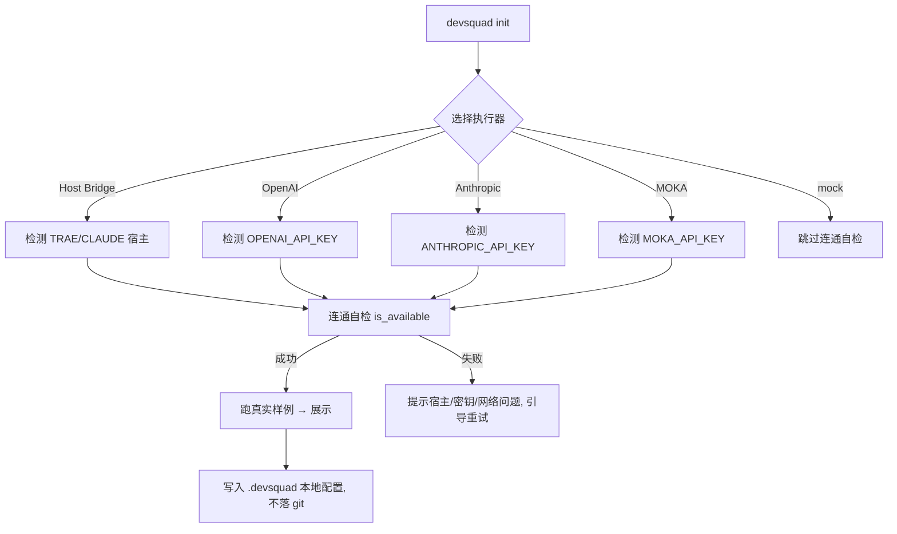

# V4.5.2 产品需求文档（PRD）— 真实执行三路径（Host Bridge / 直接 API / Mock）+ 规模分级 + 性能基线

> **文档类型**: 产品需求文档 (PRD)
> **所属迭代**: V4.5.2（4.5.x 系列小步迭代第一批）
> **最后更新**: 2026-08-20
> **状态**: 📋 待门禁评审（已并入上游 HostLLMBridge 洞察，2026-08-20 共识）
> **对接**: [V4.4.2_ROADMAP](../planning/V4.4.2_ROADMAP.md) §4
> **上游参考**: [weiransoft/TraeMultiAgentSkill](https://github.com/weiransoft/TraeMultiAgentSkill) v2.8.4 HostLLMBridge（宿主 LLM SubAgent 调度协议）

---

## 1. 产品信息

| 产品名称 | 版本 | 负责人 | 最后更新 |
|---------|------|--------|----------|
| DevSquad | V4.5.2 | 产品经理（DevSquad 7-Role 共识） | 2026-08-20 |

---

## 2. 产品概述

### 2.1 产品背景

DevSquad 初心定位（用户 2026-08-05 澄清）是**协助 TRAE / ClaudeCode / Codex 等编程 AI，对软件开发的「框架、流程、文档、架构、质量、安全、部署」进行「管控」的工具**。

当前 DevSquad 默认运行在 **Mock 模式**——`MockBackend.generate()` 仅返回带 `[MOCK MODE]` 标记的拼接提示词，不产生真实分析与评审。作为一个**软件开发管控引擎**，它必须能对编程 AI 产出的代码做**真实的**安全检查、质量审查、架构评审并给出可交付结论。无法产出真实 LLM 结论，DevSquad 就只是演示品，无法被真正投入使用。

CLI 已具备 `--backend`、`DEVSQUAD_LLM_BACKEND` 环境变量以及 OpenAI / Anthropic / Trae backend 基础（见 [llm_backend.py](../../scripts/collaboration/llm_backend.py)、[cli.py](../../scripts/cli.py)），但存在缺口：
1. **一键接通体验**不完整：缺少 MOKA AI provider 支持、缺少统一的密钥管理与连接自检、缺少"从 mock 一键切换到真实 LLM 并验证连通"的顺畅路径。
2. **Host Bridge 执行器缺失**：现有 `TraeBackend` 只是 passthrough（把 prompt 原样返回给宿主，无调度-回传闭环）。在 Trae/ClaudeCode 内**没有真实 LLM 的调度路径**，而 DevSquad 初心是管控"编程 AI 本身"——天然应让被管控的编程 AI 直接当执行器。
3. **无真实 LLM 全链路 E2E**：从未在 CI 用真实 LLM 验证过 dispatch → 7 角色 → 共识 → 报告全链路，违背用户规则 3"发布前必须模拟真实用户使用"。
4. **无性能基线**：无法度量真实 LLM 及 mock 路径的性能，后续"软件管控"自动化落地无参照。
5. **无任务规模分级**：无论大小任务都 7 角色全并行，小任务"杀鸡用牛刀"，是"真正被使用"的第二门槛（上游 S/M/L 分级门禁可解）。

### 2.2 产品目标

- **业务目标**：让 DevSquad 真正被用于软件开发管控——**真实执行三路径**按 B（Host Bridge，编程 AI 宿主）→ A（直接 API）→ C（Mock 诚实降级）顺序解析执行器，对编程 AI 产出做真实的安全/质量/架构评审；小任务不做 7 角色全并行重装展开。
- **技术目标**：统一的 LLM provider 抽象（含 MOKA）；Host Bridge 执行器（升级 TraeBackend 为 request→Task→response 闭环）；S/M/L 规模分级门禁；一键初始化 + 连通自检 + 全链路真实 LLM E2E；建立性能基线并在 CI 阻塞化。
- **用户目标**：使用者 5 分钟内从安装到产出真实管控结论，无需手工配置依赖细节；小任务快速、大任务严谨。

### 2.3 术语定义

| 术语 | 解释 |
|------|------|
| Provider / LLM provider | 真实大模型服务商：OpenAI / Anthropic / MOKA AI，以及编程 AI 宿主（Trae/ClaudeCode） |
| **Host Bridge（B 路径）** | 复用上游 HostLLMBridge 协议：脚本写 `request_{id}.json` + `protocol.marker` → 宿主 LLM 轮询 → `Task(subagent)` 执行 → `write_response()` 原子回传。执行器为编程 AI 宿主，**无需 API key** |
| 一键接通 | 通过 `devsquad init` 向导或环境变量统一配置执行器，并自动完成连通自检 |
| **执行路径顺序 B/A/C** | 解析执行器优先级：**B** Host Bridge（编程 AI 宿主）→ **A** 直接 API（有 key）→ **C** Mock（诚实降级兜底，不变量） |
| **规模分级门禁（S/M/L）** | 第一道路由：S 单文件/问答走单角色直接执行；M 单功能走三阶段迷你流；L 新项目走完整多角色流程。避免小任务杀鸡用牛刀 |
| 性能基线 | 各执行路径 + mock 的 dispatch 耗时 P95/P99、CPU、内存的基准快照 |
| 阻塞化 | CI 中性能回归超过阈值（>10%）即阻断 PR 合并 |

---

## 3. 核心功能

### 3.1 用户角色

| 角色 | 注册方式 | 核心权限 |
|------|----------|----------|
| DevSquad 管控使用者 | 本机安装 | 配置 provider、执行 dispatch、获取真实管控结论 |
| 编程 AI 开发者 | TRAE/Codex | 其产出被 DevSquad 审查管控（可读报告） |
| CI/DevOps | CI 集成 | 触发性能回归门禁、查看基线 |

### 3.2 功能模块

| 模块 | 功能描述 | 优先级 | 备注 |
|------|---------|--------|------|
| **LLM Provider 统一抽象** | 在现有 `LLMBackend` 基础上补齐 MOKA，统一 `create_backend()` 工厂，并新增 **HostBridgeBackend（B 路径）** | P0 | V500-5 |
| **Host Bridge 执行器（B）** | 升级 `TraeBackend`：复用上游 HostLLMBridge 文件协议（request→protocol.marker→Task→write_response 原子回传 + 熔断），平台检测 host_llm>claude_code>unknown | P0 | 新增（上游 v2.8.4 HostLLMBridge） |
| **执行路径顺序 B/A/C** | `create_backend` 解析器按 **B Host Bridge → A 直接 API → C Mock** 顺序返回可用执行器；AI 诚实降级，无伪装输出 | P0 | 用户决策 2026-08-20 |
| **S/M/L 规模分级门禁** | dispatch 前置第一道路由：S 单文件/问答→单角色直接执行；M 单功能→三阶段迷你流；L 新项目→完整多角色流程；强顺序链禁用多 Agent | P0 | 新增（上游 S/M/L 分级） |
| **一键接通向导** | `devsquad init` 扩展：选择执行器（Host Bridge / 直接 API）→ 检测/输入密钥或宿主 → 连通自检（`is_available()`）→ 展示真实样例 | P0 | V500-5 |
| **统一密钥管理** | 密钥仅从环境变量/本地配置读取，写入 `.gitignore`，不落代码与文档；Host Bridge 无需密钥 | P0 | 安全约束 |
| **真实 LLM 全链路 E2E** | CI 用真实 LLM 跑 dispatch → 7 角色 → 共识 → 报告的端到端测试（release tag 触发）；B 路径额外做 Host Bridge 端到端 | P0 | 用户规则 3 |
| **性能基线 snapshot** | 采集各执行路径 + mock 的 P95/P99/CPU/memory，沉淀为基线文件 | P1 | V451-4 |
| **CI 性能阻塞化** | 性能 job 由 `|| true` 改为阻断，回归 >10% 拦截合并 | P2 | V451-5 |

### 3.3 页面/接口详情

| 接口 | 模块 | 说明 |
|------|------|------|
| `devsquad init`（增强） | 一键接通 | 新增 Host Bridge 与 MOKA 选项 + 连通自检步骤 |
| `devsquad dispatch --backend host\|auto\|openai\|anthropic\|moka\|mock` | 一键接通 | `host` 走 HostBridgeBackend；`auto` 按 B/A/C 顺序解析 |
| `create_backend("host", ...)` | Provider 抽象 | 新增 HostBridgeBackend（复用上游 HostLLMBridge） |
| `create_backend("auto", ...)` | Provider 抽象 | 解析顺序改为 **B→A→C** |
| **规模分级前置** | 规模门禁 | dispatch 入口先判 S/M/L 再决定角色编排 |
| `devsquad benchmark`（命令） | 性能基线 | 采集并写出基线 snapshot |
| CI performance job | 性能阻塞化 | 基线比对 + 阈值判断 |

---

## 4. 核心流程

### 4.1 用户旅程（真实执行三路径 + 规模分级）

| 阶段 | 用户目标 | 用户行为 | 系统响应 | 情感 |
|------|----------|----------|----------|------|
| 安装配置 | 装好且能出真实结论 | `pip install devsquad` + `devsquad init` | 引导选择执行器（Host Bridge 或直接 API），指导配置 | 顺畅 |
| 连通自检 | 确认能出真实结论 | 选 Host Bridge / MOKA / OpenAI | 检测宿主或 key，调 `is_available()` + 跑真实样例 | 可信 |
| 发布小任务 | 快速获得结果 | `devsquad dispatch -t "修复这个函数"` | S/M/L 分级 → 单角色直接执行，不重装 7 角色 | 轻快 |
| 发起管控 | 对编程 AI 产出做真实评审 | `devsquad dispatch -t "安全审计该代码" -r security` | 真实 LLM 多角色评审 → 共识报告 | 有价值 |
| CI 性能门禁 | 防性能回退 | 提交 PR | 跑基准对比，>10% 阻断 | 稳妥 |

### 4.2 执行路径解析流程图（B/A/C）

```mermaid
flowchart TD
    A[dispatch] --> S{规模分级}<br/>第一道路由
    S -->|S 单文件/问答| S1[单角色直接执行]
    S -->|M 单功能| S2[三阶段迷你流<br/>设计要点→开发→测试验证]
    S -->|L 新项目| S3[完整多角色流程<br/>7 角色 + 共识]
    S1 --> B{执行路径 B/A/C}
    S2 --> B
    S3 --> B
    B -->|B 优先| HOST[检测编程 AI 宿主<br/>TRAE_ENV / CLAUDE_CODE_ENV]
    HOST -->|host_llm/claude_code 可用| BRIDGE[HostBridgeBackend<br/>request→marker→Task→response]
    BRIDGE -->|成功| OUT[真实结论报告]
    BRIDGE -->|单次超时/失败 或 连续2次同因失败(熔断跳过B)| A
    B -->|A| API{有 API Key?}
    API -->|有| DIRECT[直接 API<br/>OpenAI/Anthropic/MOKA]
    DIRECT --> OUT
    API -->|无| C[Mock 诚实降级<br/>明确标注非真实结论]
    A --> C
```

### 4.3 Host Bridge 时序（B 路径，复用上游 HostLLMBridge）

```
DevSquad 脚本                       宿主 LLM (Trae/ClaudeCode)
    │                                     │
    ├─1─> HostLLMBridge.create_request()  │
    │     写 request_{id}.json + prompt   │
    │     写 protocol.marker（独立通道）  │
    ├─2─> wait_for_response(id, 600s)     │
    │     每 0.5s 轮询 response_{id}.json │
    │                                     │ ─3─> 每 5s 读 protocol.marker
    │                                     │ ─4─> 读 request_{id}.json 取完整 prompt
    │                                     │ ─5─> Task(subagent_type, query=task) 执行
    │                                     │ ─6─> HostLLMBridge.write_response() 原子回传
    │                                     │      （tempfile + os.replace + 清 marker）
    ├─7─> 读取 response_{id}.json → 返回   │
    ├─8─> 连续 2 次同因超时 → 熔断跳过 B   │
    └─9─> 降级 A（有 key）或 C（mock），继续出结论
```

### 4.4 一键接通流程图（直接 API 分支，保留）



### 4.5 解密安全约束

- 直接 API 密钥仅存环境变量（`DEVSQUAD_LLM_BACKEND`、`OPENAI_API_KEY`、`ANTHROPIC_API_KEY`）或本地 `.devsquad`（已在 `.gitignore` 中）。
- Host Bridge 路径**无需密钥**，天然规避口令暴露风险；执行器为编程 AI 宿主本身。
- 任何代码、文档、commit、服务器配置中不得出现明文密钥。

---

## 5. 非功能性需求

### 5.1 性能
- 真实执行路径（Host Bridge / 直接 API）的 P95 首次可用（连通后一次 dispatch），mock 路径 P95 变化 <10%。
- Host Bridge 轮询用 `time.sleep(0.5)` 非 busy-wait；完整 dispatch 默认超时 600s，可自定义。
- 建立基线文件 `docs/reference/PERFORMANCE_BASELINE.md`（含各执行路径 P95/P99/CPU/memory）。

### 5.2 可靠性
- 执行路径不可达时清晰报错并**按 B/A/C 顺序降级**（不崩溃、不改 mock 默认行为）。
- **降级语义（B 路径）**：B **单次失败/超时 → 降级 A**（有 key）或 C（mock），继续给用户结论，并附降级提示；**连续 2 次同因失败 → 熔断“跳过 B”**，本 dispatch 仅走 A/C（避免 600s×N 反复等待）——熔断为跳过 B、**不 fatal 终止整体**，保证 DevSquad 作为管控引擎始终产出结论。
- auto 模式保持"真实优先、权重降级"（B 优先，其次 A，最后 C）。

### 5.3 安全性
- 直接 API 密钥不落代码/文档/日志；`.gitignore` 校验通过。
- Host Bridge 文件协议做好请求 ID 校验（仅 `[a-zA-Z0-9_]`）+ request_file 路径域校验（拒绝路径遍历）。
- 真实 LLM E2E 仅在 release tag 事件触发，避免泄露密钥。

### 5.4 兼容性
- Python 3.10/3.11/3.12 均可用；CI 矩阵不变。
- 新增 MOKA 与 Host Bridge**不改动** mock/OpenAI/Anthropic 现有接口。
- Host Bridge 平台检测：`TRAE_ENV`/`TRAE_AGENT_PATH` → host_llm；`CLAUDE_CODE_ENV`/`ANTHROPIC_ENV` → claude_code；无 → unknown（诚实降级）。

---

## 6. 数据需求

### 6.1 数据结构

| 数据实体 | 字段名称 | 数据类型 | 约束 | 描述 |
|---------|---------|----------|------|------|
| BackendConfig | backend | str | host/mock/openai/anthropic/moka | 实际执行后端 |
| BackendConfig | api_key_ref | str | 环境变量名 | 引用密钥而非值（Host Bridge 为空） |
| BackendConfig | host_platform | str | host_llm/claude_code/unknown | Host Bridge 平台 |
| BackendConfig | base_url / model | str | 可选 | MOKA 端点 / 模型名 |
| BridgeRequest | request_id | str | 时间戳 + UUID 短格式 | Host Bridge 调度请求 ID |
| BridgeResponse | success / output / error | str | 原子写入 tempfile+os.replace | Host Bridge 结果 |
| TaskScale | level | str | S/M/L | 规模分级门禁结果 |
| PerfSnapshot | provider | str | | 各执行路径 + mock |
| PerfSnapshot | p95 / p99 / cpu / memory | float | | 基线数值 |

### 6.2 数据存储
- BackendConfig 存本地 `.devsquad`（gitignore）；Host Bridge 桥接文件存 `logs/host_llm_bridge/`；性能基线存 `docs/reference/PERFORMANCE_BASELINE.md`。

---

## 7. 范围限定

### 7.1 包含功能
- HostBridgeBackend（B 路径，复用上游 HostLLMBridge 协议）+ 平台检测
- MOKA provider + 统一 `create_backend` 路由，解析顺序 **B/A/C**
- S/M/L 规模分级门禁（第一道路由）
- `devsquad init` 一键接通 + 连通自检
- 真实 LLM 全链路 E2E（release tag 触发）
- 性能基线 snapshot + CI 阻塞化

### 7.2 排除功能
- 不新增 UI（依赖已有 Dashboard）
- 不做多执行路径并发/故障转移编排（后续迭代）
- 不做费用/用量计费（另属商业网关层）
- **不做完整 Runtime 重写**、不做分布式组件编排（上游拒绝的特性，DevSquad 拒绝）

### 7.3 边界条件
- 无密钥且无宿主时行为与现状一致（mock 默认），不阻塞现有用户。
- MOKA 仅在配置了对应密钥时启用；Host Bridge 仅在编程 AI 宿主环境启用。
- 强顺序依赖任务按上游经验退化为单角色链式，**禁用多 Agent 并行改进**（避免反降 39-70%）。

---

## 8. 项目计划

### 8.1 迭代流程（门禁驱动）
1. **PRD** 评审门禁（本文档）→ 通过进入设计
2. **设计** `V4.5.2_ARCHITECTURE.md` → 通过进入开发
3. **测试方案** `V4.5.2_TEST_PLAN.md`（含 Host Bridge 端到端 + 真实 LLM e2e + 性能基准）→ 通过进入开发
4. **开发** + 单测 + 反幽灵验证
5. **E2E 门禁**：Host Bridge 全链路 + 真实 LLM 全链路 + 规模分级 + 性能回归
6. **发布** V4.5.2，版本号全局同步

### 8.2 资源需求
- 不新增第三方硬依赖（MOKA 走已有 backend 抽象，用 HTTP 客户端；Host Bridge 为纯文件协议，零依赖）。

### 8.3 风险评估

| 风险点 | 影响 | 可能性 | 应对 |
|-------|------|--------|------|
| Host Bridge 宿主不轮询 | B 路径超时 | 中 | 600s 超时 + 连续 2 次熔断 fatal（上游经验） |
| 真实 LLM E2E 需 API key | CI 无法默认跑 | 中 | 仅 release tag + CI secrets |
| B 路径文件协议安全 | 越界读取/写入 | 低 | request_id 校验 + 路径域校验 + 原子写入 |
| 规模分级误过滤 | 功能缺失（新幽灵） | 中 | 保守起步 + 反幽灵 E2E 扩展 |
| MOKA API 契约不稳定 | 连通失败 | 中 | 文档记录端点/模型，可配置 base_url |
| 性能基线波动大 | 门禁误报 | 中 | 用 P95 而非平均值，阈值 >10% |
| provider 密钥泄露 | 安全 | 低 | 严格 gitignore + release-only 触发 + Host Bridge 免密钥 |

---

## 9. 验收标准

### 9.1 功能验收
- [ ] `create_backend("host", ...)` 在宿主环境创建 HostBridgeBackend，`is_available()` 正确返回。
- [ ] `create_backend("auto", ...)` 按 **B（宿主在）→ A（key 在）→ C（mock）** 顺序解析执行器。
- [ ] B 路径单次超时/失败 → 降级 A（有 key）或 C（mock）继续出结论；连续 2 次同因失败 → 熔断跳过 B 而非 fatal 终止。
- [ ] S/M/L 规模分级门禁正确路由：S→单角色、M→迷你流、L→完整多角色。
- [ ] `devsquad init` 可选择 Host Bridge / MOKA，完成连通自检并展示真实样例。
- [ ] dispatch 用任一真实执行路径产出评审 + 共识报告，无 `[MOCK MODE]` 标记。
- [ ] 无密钥且无宿主时行为与 V4.5.1 一致（mock 默认），回归通过。

### 9.2 性能验收
- [ ] mock 路径 P95 相对基线上次快照变化 <10%。
- [ ] `benchmark` 命令可产出基线文件。

### 9.3 安全验收
- [ ] grep 源码/文档，无明文 API Key。
- [ ] `.gitignore` 覆盖 `.devsquad` 与环境密钥文件。
- [ ] Host Bridge 拒绝路径遍历的 request_id / request_file。

### 9.4 E2E 门禁（用户规则 3）
- [ ] Host Bridge 端到端（宿主读 marker→Task→原子回传→脚本接收）模拟真实用户 E2E 通过。
- [ ] 真实 LLM 全链路模拟真实用户 E2E 通过（release 触发）。

---

## 10. 附录

### 10.1 参考文档
- [ROADMAP](../planning/V4.4.2_ROADMAP.md) §4 4.5.x 系列
- [llm_backend.py](../../scripts/collaboration/llm_backend.py) 现有后端抽象
- [cli.py](../../scripts/cli.py) 现有 backend 参数/环境变量
- 上游 [weiransoft/TraeMultiAgentSkill](https://github.com/weiransoft/TraeMultiAgentSkill) v2.8.4 HostLLMBridge 设计文档 `docs/dev/HOST_LLM_BRIDGE_DESIGN.md`（request/marker/response 文件协议 + 原子写入 + 连续失败熔断 + S/M/L 规模分级）
- PRD 模板按 [docs/roles/product-manager/PRD_TEMPLATE.md](../roles/product-manager/PRD_TEMPLATE.md)

### 10.2 其他说明
- 本文档为 V4.5.2 迭代 PRD（真实执行三路径 B/A/C + 规模分级门禁 + 性能基线），属起步迭代，为后续 Artifacts/Effect 回滚等打基础。
- 统一考虑结论（2026-08-20 共识）：并入上游 HostLLMBridge（B 路径）与 S/M/L 规模分级门禁，执行器对编程 AI 宿主开放，解析顺序 B→A→C；拒绝上游 Runtime 重写/分布式编排等过度设计。
- 门禁未通过时返回对应步骤改进，全部通过才推进开发。