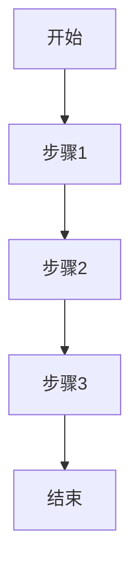

# 产品需求文档模板 (PRD)

> **文档类型**: 产品需求文档 (Product Requirements Document)  
> **负责角色**: 产品经理 (Product Manager)  
> **文档位置**: `docs/product-manager/PRD_<项目名称>_<版本号>.md`

---

## 文档信息

| 项目 | 内容 |
|------|------|
| 文档名称 | |
| 产品名称 | |
| 版本号 | v1.0.0 |
| 创建日期 | YYYY-MM-DD |
| 最后更新 | YYYY-MM-DD |
| 负责产品经理 | |
| 审核人 | |
| 状态 | 草稿/评审中/已批准/已归档 |

---

## 更新履历

| 版本 | 日期 | 更新人 | 更新内容 | 审核状态 |
|------|------|--------|----------|----------|
| v1.0.0 | YYYY-MM-DD | 产品经理姓名 | 初始版本创建 | 待审核 |
| v1.1.0 | YYYY-MM-DD | 产品经理姓名 | 更新内容描述 | 已审核 |

---

## 1. 文档概述

### 1.1 文档目的
- **目标读者**: 开发团队、测试团队、设计团队、业务方
- **文档用途**: 明确产品需求、指导开发实施、验收测试依据
- **阅读建议**: 先读第2章背景，再读第3章需求详情

### 1.2 术语表

| 术语 | 定义 | 说明 |
|------|------|------|
| 术语A | 定义描述 | 补充说明 |
| 术语B | 定义描述 | 补充说明 |

### 1.3 参考资料
- [竞品分析报告](./COMPETITOR_ANALYSIS_<项目名称>.md)
- [用户调研报告](./USER_RESEARCH_<项目名称>.md)
- [架构设计文档](../architect/ARCHITECTURE_DESIGN_<项目名称>.md)

---

## 2. 产品背景

### 2.1 市场背景
- **市场现状**: 描述当前市场状况和趋势
- **市场机会**: 识别市场空白和机会点
- **市场规模**: 目标市场的规模和增长潜力

### 2.2 用户痛点
- **痛点描述**: 用户当前面临的核心问题
- **痛点验证**: 数据或调研支撑痛点的真实性
- **痛点优先级**: 按影响程度和频率排序

### 2.3 竞品分析

#### 2.3.1 直接竞品
| 竞品名称 | 核心功能 | 优势 | 劣势 | 市场份额 |
|----------|----------|------|------|----------|
| 竞品A | 功能列表 | 优势描述 | 劣势描述 | X% |
| 竞品B | 功能列表 | 优势描述 | 劣势描述 | Y% |

#### 2.3.2 差异化策略
- **功能差异化**: 我们独有的功能
- **体验差异化**: 更好的用户体验
- **AI 赋能**: 利用 AI 提升效率或体验的差异化点

### 2.4 产品目标

#### 2.4.1 核心指标 (North Star Metric)
- **北极星指标**: 衡量产品核心价值的唯一关键指标
- **关联指标**: 支撑北极星指标的一级/二级指标

#### 2.4.2 业务目标
| 目标项 | 指标 | 目标值 | 时间周期 |
|--------|------|--------|----------|
| 用户增长 | 日活用户(DAU) | X万 | 3个月 |
| 收入增长 | 月收入(MAU) | Y万 | 6个月 |
| 留存提升 | 7日留存率 | Z% | 3个月 |

---

## 3. 需求分析

### 3.1 用户画像

#### 3.1.1 目标用户
| 用户类型 | 用户描述 | 核心需求 | 使用场景 | 占比 |
|----------|----------|----------|----------|------|
| 用户A | 描述 | 需求列表 | 场景描述 | X% |
| 用户B | 描述 | 需求列表 | 场景描述 | Y% |

#### 3.1.2 用户故事地图
```
用户活动: 活动A
├── 用户任务: 任务A1
│   ├── 用户故事: 故事A1-1
│   └── 用户故事: 故事A1-2
└── 用户任务: 任务A2
    ├── 用户故事: 故事A2-1
    └── 用户故事: 故事A2-2
```

### 3.2 功能需求

#### 3.2.1 功能清单

| 功能ID | 功能名称 | 功能描述 | 优先级 | 所属模块 | 状态 |
|--------|----------|----------|--------|----------|------|
| F-001 | 功能A | 功能描述 | P0 | 模块A | 待开发 |
| F-002 | 功能B | 功能描述 | P1 | 模块A | 待开发 |
| F-003 | AI助手 | 智能问答与推荐 | P1 | AI模块 | 待开发 |

#### 3.2.2 功能详情

##### F-001: 功能A

**功能概述**
- **功能目标**: 功能要实现的目标
- **用户价值**: 为用户带来的价值
- **业务价值**: 为业务带来的价值

**用户故事**
```
作为 [用户角色]
我希望 [功能描述]
以便 [实现价值]
```

**业务流程**


**页面原型**
- **原型链接**: [Figma/Axure链接]
- **交互说明**: 关键交互点说明
- **状态说明**: 页面状态变化说明

**数据需求**
| 数据项 | 数据类型 | 数据来源 | 数据格式 | 埋点需求 |
|--------|----------|----------|----------|----------|
| 数据A | String | 用户输入 | 文本 | 点击埋点 |
| 数据B | Number | 系统计算 | 数值 | 曝光埋点 |

### 3.3 AI 与数据需求 (新)

#### 3.3.1 AI 功能需求
- **场景描述**: AI 在该场景下解决什么问题
- **输入数据**: 用户输入、上下文数据
- **输出结果**: 文本、推荐列表、操作建议
- **模型要求**: 响应速度、准确率要求

#### 3.3.2 数据埋点需求
| 事件ID | 事件名称 | 触发时机 | 属性参数 | 备注 |
|--------|----------|----------|----------|------|
| E_001 | page_view | 进入页面 | page_id, referrer | |
| E_002 | click_btn | 点击按钮 | btn_id, btn_name | |

### 3.4 非功能需求

#### 3.4.1 性能需求
| 需求项 | 需求描述 | 指标要求 | 测试方法 |
|--------|----------|----------|----------|
| 响应时间 | 页面加载时间 | < 2秒 | 性能测试 |
| AI响应 | 模型推理时间 | < 1秒 | 接口测试 |

#### 3.4.2 安全需求
| 需求项 | 需求描述 | 实现方式 | 验收标准 |
|--------|----------|----------|----------|
| 数据隐私 | 用户数据脱敏 | 敏感字段脱敏 | 安全审计 |
| 内容安全 | AI生成内容审核 | 关键词过滤 | 内容审查 |

---

## 4. 验收标准

### 4.1 功能验收标准

#### 4.1.1 验收测试用例

| 用例ID | 用例名称 | 前置条件 | 测试步骤 | 预期结果 | 优先级 |
|--------|----------|----------|----------|----------|--------|
| TC-001 | 正常流程测试 | 条件描述 | 1. 步骤1<br>2. 步骤2 | 预期结果 | P0 |
| TC-002 | AI回答准确性 | 提问特定问题 | 输入问题 | 回答符合预期 | P1 |

### 4.2 用户体验验收标准

| 检查项 | 检查内容 | 通过标准 | 检查方式 | 负责人 |
|--------|----------|----------|----------|--------|
| 界面设计 | 是否符合设计稿 | 像素级还原 | 视觉走查 | 设计师 |
| AI交互 | 等待过程反馈 | 有加载动画/流式输出 | 交互测试 | 产品经理 |

---

## 5. 任务拆分与规划

### 5.1 需求实施任务

#### 5.1.1 任务清单

| 任务ID | 任务名称 | 任务描述 | 依赖任务 | 预估工时 | 负责人 | 状态 |
|--------|----------|----------|----------|----------|--------|------|
| PM-001 | 需求调研 | 完成用户调研和竞品分析 | 无 | 3天 | 产品经理 | 待开始 |
| PM-002 | PRD编写 | 编写产品需求文档 | PM-001 | 5天 | 产品经理 | 待开始 |
| PM-003 | AI场景定义 | 定义AI应用场景和数据流 | PM-001 | 2天 | 产品经理 | 待开始 |

---

## 6. 风险评估

### 6.1 需求风险

| 风险项 | 风险等级 | 影响范围 | 缓解措施 | 负责人 |
|--------|----------|----------|----------|--------|
| AI幻觉 | 中 | 用户信任 | 增加人工审核/引用来源 | 产品经理 |
| 数据合规 | 高 | 产品上线 | 咨询法务/数据脱敏 | 产品经理 |

---

## 7. 附录

### 7.1 相关文档
- [架构设计文档](../architect/ARCHITECTURE_DESIGN_<项目名称>.md)
- [测试计划](../test-expert/TEST_PLAN_<项目名称>.md)

---

**文档结束**

> 本文档由产品经理角色创建和维护，任何修改必须更新版本号和更新履历。
