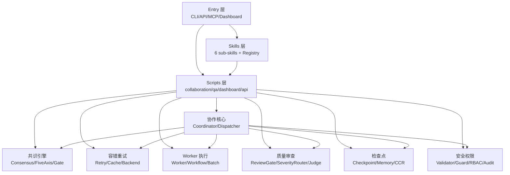

# DevSquad 项目结构文档

> **文档类型**: 项目结构文档 (Project Structure Document)
> **负责角色**: 架构师
> **文档位置**: `docs/spec/PROJECT_STRUCTURE.md`
> **最后更新**: 2026-07-19 (V4.1.1)

---

## 文档信息

| 项目 | 内容 |
|------|------|
| 文档名称 | DevSquad 项目结构文档 |
| 项目名称 | DevSquad — Multi-Role AI Task Orchestrator |
| 版本号 | V4.1.1 |
| 创建日期 | 2026-07-19 |
| 最后更新 | 2026-07-19 |
| 起草人 | Architect Role |
| 审核人 | 7-Role Consensus |
| 状态 | 已批准 |
| 活文档原则 | 代码与文档同步演进，每次版本发布必须同步更新 |

---

## 1. 项目概览

### 1.1 基本信息
- **项目名称**: DevSquad — Multi-Role AI Task Orchestrator
- **项目路径**: 仓库根目录
- **项目类型**: Python 库 + CLI + REST API + Web Dashboard + MCP Server
- **技术栈**: Python 3.10+, pytest, mypy, ruff, bandit, radon, GitHub Actions CI
- **入口点**:
  - CLI: `scripts/cli.py` (主) + `scripts/cli_dispatch.py` + `scripts/cli_lifecycle.py`
  - REST API: `scripts/api_server.py` (FastAPI)
  - MCP Server: `scripts/mcp_server.py` (FastMCP)
  - Dashboard: `scripts/dashboard.py` (Streamlit)
- **核心理念**: One task → Multi-role AI collaboration → One conclusion

### 1.2 项目统计
- **核心模块数**: 185+ (scripts/collaboration/ ~150 + skills/ 11 + scripts/qa/ 6 + scripts/dashboard/ 9 + scripts/api/ 9 + scripts/cli/ 2 + scripts/utils/ 2 + scripts/ 根级 19)
- **测试数**: 5250+ CI passing (5355 collected)
- **CI Job 数**: 4 (lint + test + security + build)
- **覆盖率**: ≥70% (CI 门禁)
- **mypy**: 0 errors (scripts/ + skills/)
- **ruff**: 0 errors
- **bandit**: 0 High/Medium
- **radon cc**: 0 D+ functions (complexity < 16)

---

## 2. 目录结构

### 2.1 整体结构

```
DevSquad/
├── scripts/                  # 主代码 (collaboration/qa/dashboard/api/cli/utils + 根级入口)
│   ├── api/                  # REST API 子包 (FastAPI routes + models + security)
│   │   ├── routes/           # 5 个路由模块 (dispatch/lifecycle/metrics/metrics_gates)
│   │   ├── models.py         # API 数据模型
│   │   ├── rate_limit.py     # 速率限制
│   │   └── security.py       # API 安全 (API Key + RBAC)
│   ├── cli/                  # CLI 子包
│   │   ├── cli_visual.py     # 可视化输出
│   │   └── __init__.py
│   ├── collaboration/        # 协作核心包 (~150 .py + 4 子包)
│   │   ├── autonomous/       # V4.0.0 自治循环 (7 模块)
│   │   ├── loop_engineering/ # V4.0.0 Loop Engineering (9 模块)
│   │   ├── plugins/          # V4.0.0 插件热加载 (2 模块)
│   │   ├── role_skills/      # 7 角色 SKILL.md (Matt Pocock 借鉴)
│   │   ├── _version.py       # collaboration 包单一真相源
│   │   ├── __init__.py       # 公共 API + __all__ 边界
│   │   └── *.py              # ~150 个核心模块 (详见 §3)
│   ├── dashboard/            # Streamlit Dashboard (9 模块)
│   │   ├── app.py            # Dashboard 主入口
│   │   ├── auth_views.py     # 认证视图
│   │   ├── components.py     # 共享组件
│   │   ├── dag_views.py      # DAG 可视化
│   │   ├── dispatch_views.py # Dispatch 视图
│   │   ├── lifecycle_views.py # 生命周期视图
│   │   ├── metrics_views.py  # 指标视图
│   │   └── state.py          # 状态管理
│   ├── qa/                   # V4.1.0 UI/UX 与 QA (6 模块)
│   │   ├── uiux_analyzer.py  # UI/UX 4 维度分析 (a11y/interaction/layout/ux_antipattern)
│   │   ├── deterministic_rule_engine.py # 46+ 确定性规则 (impeccable 借鉴)
│   │   ├── taste_dials.py    # Taste Dials (0-1 视觉品味, taste-skill 借鉴)
│   │   ├── visual_regression.py # 视觉回归
│   │   └── models.py         # QA 数据模型
│   ├── utils/                # 通用工具
│   │   └── _find_missing_hints.py
│   ├── __init__.py
│   ├── api_server.py         # REST API 入口 (FastAPI)
│   ├── auth.py               # 认证 (secrets 密码哈希)
│   ├── benchmark_*.py        # 3 个 benchmark 脚本
│   ├── check_dependency_sync.py # 依赖同步检查
│   ├── check_version_consistency.py # 版本一致性检查 (含 skills/ + docs/)
│   ├── cli.py                # CLI 主入口
│   ├── cli_dispatch.py       # CLI dispatch 子命令
│   ├── cli_lifecycle.py      # CLI 生命周期子命令
│   ├── cli_utils.py          # CLI 共享工具 (LifecyclePreset 等)
│   ├── dashboard.py          # Streamlit Dashboard 入口
│   ├── generate_benchmark_report.py
│   ├── history_manager.py    # 历史记录管理
│   ├── mcp_server.py         # MCP Server 入口 (FastMCP)
│   ├── publish_now.sh        # PyPI 发布脚本
│   ├── start.sh              # 启动脚本
│   └── sync_trae_skill.sh    # TRAE skill 同步
├── skills/                   # Skills 层 (6 sub-skills + registry)
│   ├── _version.py           # skills 包单一真相源
│   ├── __init__.py
│   ├── registry.py           # Skill 注册表 (异常已加 logger.warning)
│   ├── dispatch/             # dispatch skill
│   ├── intent/               # intent skill
│   ├── retrospective/        # retrospective skill
│   ├── review/               # review skill
│   ├── security/             # security skill
│   └── test/                 # test skill
├── tests/                    # 测试层 (5 层体系)
│   ├── unit/                 # V4.1.2+ 单元测试 marker (新增)
│   ├── smoke/                # 冒烟测试 (含真实 LLM)
│   ├── integration/          # 集成测试
│   ├── e2e/                  # 端到端测试 (4 个 user journey)
│   ├── contract/             # 契约测试 (7 个 provider)
│   ├── test_*.py             # ~160 个根级测试文件
│   └── __init__.py
├── docs/                     # 文档目录
│   ├── _archive/             # 归档文档 (含 CODE_MAP_SPEC.md 等模板)
│   ├── adr/                  # Architecture Decision Records (5 个 ADR)
│   ├── architecture/         # 架构设计 (ARCHITECTURE_V4.md 等)
│   ├── assessments/          # 评估报告
│   ├── audits/               # 审计报告 (V4.1.1 WorkBuddy Review 等)
│   ├── guides/               # 用户指南 (10+ 篇)
│   ├── i18n/                 # 国际化文档 (EN/CN/JP)
│   ├── operations/           # 运维文档
│   ├── planning/             # 规划文档
│   ├── prd/                  # 产品需求文档 (4 个 PRD)
│   ├── research/             # 研究文档
│   ├── roles/                # 7 角色模板
│   ├── spec/                 # 规范文档 (本文件 + SPEC/CONSTITUTION/GLOSSARY/DESIGN)
│   └── testing/              # 测试策略文档
├── examples/                 # 示例代码 (4 个)
├── templates/                # concern packs 模板 (5 个)
├── helm/                     # Helm chart
├── config/                   # 部署配置样本
├── .github/                  # CI/CD 配置
│   ├── workflows/            # test.yml + release.yml
│   ├── ISSUE_TEMPLATE/       # Issue 模板
│   ├── PULL_REQUEST_TEMPLATE.md
│   └── dependabot.yml
├── pyproject.toml            # 项目元数据 + 工具配置 (PEP 621)
├── .devsquad.yaml            # DevSquad 运行时配置
├── .pre-commit-config.yaml   # Pre-commit hooks
├── Dockerfile                # Docker 镜像
├── docker-compose.yml        # 本地开发栈
├── docker-compose.redis.yml  # Redis 集成测试
├── conftest.py               # pytest 全局 fixture
├── VERSION                   # 单一版本真相源 (V4.1.1)
├── SKILL.md                  # DevSquad Skill 文档
├── skill-manifest.yaml       # Skill 清单
├── README.md / README-CN.md / README-JP.md # 三语 README
├── QUICKSTART.md             # 30 秒入门
├── CHANGELOG.md / CHANGELOG-CN.md # 变更日志
├── CONTRIBUTING.md           # 贡献指南
├── CLAUDE.md                 # Claude Code 配置
├── COMPARISON.md             # 同类产品对比
├── INSTALL.md                # 安装指南
├── GUIDE.md / EXAMPLES.md    # 使用指南与示例
├── RELEASE_CHECKLIST.md      # 发布清单
└── LICENSE                   # MIT
```

### 2.2 模块结构（按职责分组）

| 模块组 | 目录路径 | 主要职责 | 文件数 |
|--------|----------|----------|--------|
| 协作核心 | `scripts/collaboration/` | 7 角色并行协作引擎 | ~150 + 4 子包 |
| QA 与 UI/UX | `scripts/qa/` | UI/UX 审查 + 视觉回归 | 6 |
| Dashboard | `scripts/dashboard/` | Streamlit Web 界面 | 9 |
| REST API | `scripts/api/` | FastAPI 路由 + 安全 | 9 |
| CLI | `scripts/cli/` + 根级 cli*.py | 命令行界面 | 5 |
| Skills | `skills/` | 6 sub-skill handlers | 11 |
| 工具 | `scripts/utils/` | 通用工具 | 2 |
| 入口 | `scripts/` 根级 | 服务器入口 + benchmark | 19 |
| 测试 | `tests/` | 5 层测试体系 | ~175 |

---

## 3. 代码 Map

### 3.1 核心入口文件

| 文件路径 | 文件类型 | 主要功能 |
|----------|----------|----------|
| `scripts/cli.py` | CLI 入口 | `devsquad` 命令主入口，argparse 子命令分发 |
| `scripts/cli_dispatch.py` | CLI 子命令 | `devsquad dispatch` 命令，参数验证 + dispatch 调用 |
| `scripts/cli_lifecycle.py` | CLI 子命令 | `devsquad lifecycle` 命令，6 个生命周期阶段视图 |
| `scripts/cli_utils.py` | CLI 工具 | LifecyclePreset TypedDict + LIFECYCLE_PRESETS + 共享函数 |
| `scripts/api_server.py` | REST API | FastAPI 应用 + 路由注册 + 中间件 |
| `scripts/mcp_server.py` | MCP Server | FastMCP Server，codegraph_explore 等工具暴露 |
| `scripts/dashboard.py` | Dashboard | Streamlit 应用入口，加载 dashboard/ 子包 |
| `scripts/auth.py` | 认证 | 密码哈希 (secrets) + JWT 令牌 |

### 3.2 协作核心模块 (scripts/collaboration/)

#### 3.2.1 Coordinator / Dispatcher (调度核心)

| 类名 | 文件路径 | 功能描述 |
|------|----------|----------|
| `Coordinator` | `coordinator.py` | 同步 dispatch 编排器 (ThreadPoolExecutor 并行) |
| `AsyncCoordinator` | `async_coordinator.py` | 异步 dispatch 编排器 (V4 主路径, asyncio.gather 容错) |
| `MultiAgentDispatcher` | `dispatcher.py` | 43 参数构造器 (P1-4 待重构为 DispatcherConfig) |
| `PostDispatchPipeline` | `dispatch_steps.py` | 后处理管线 (Steps 8-23) |
| `ResultAssembler` | `dispatch_result_assembler.py` | 结果组装器 |
| `DispatcherFactory` | `dispatcher_factory.py` | Dispatcher 工厂 |
| 6 个 Mixin | `dispatcher_*_mixin.py` | status/lifecycle/audit/error/async/utils |
| 4 个 Steps Mixin | `dispatch_steps_*_mixin.py` | consensus/feedback/quality/services |

#### 3.2.2 共识引擎

| 类名 | 文件路径 | 功能描述 |
|------|----------|----------|
| `ConsensusEngine` | `consensus.py` | 加权投票 + 否决权 (weight < 0 触发 ESCALATED) |
| `FiveAxisConsensusEngine` | `five_axis_consensus.py` | 五轴共识 (深度/广度/一致性/风险/可执行性) |
| `ConsensusGate` | `consensus_gate.py` | 决策前共识门 (HC-2 硬约束) |
| `ROLE_WEIGHTS` | `models_dispatch.py` | 权重真相源 (architect:1.5, security:1.1, ...) |

#### 3.2.3 容错与重试

| 类名 | 文件路径 | 功能描述 |
|------|----------|----------|
| `LLMRetryManager` | `llm_retry.py` + `llm_retry_async.py` + `llm_retry_base.py` | 指数退避 + 熔断器 |
| `LLMCache` | `llm_cache.py` + `llm_cache_async.py` + `llm_cache_base.py` | LRU + TTL 缓存 |
| `MultiLevelCacheCoordinator` | `multi_level_cache.py` | 三层缓存协调 (memory/disk/redis) |
| `AsyncLLMBackend` | `async_llm_backend.py` + `llm_backend.py` | 异步/同步 LLM 后端 (OpenAI/Anthropic/Mock) |
| `AsyncFallbackBackend` | `async_llm_backend.py` | "auto" 后端 (真实 LLM → Mock 回退) |

#### 3.2.4 安全与权限

| 类名 | 文件路径 | 功能描述 |
|------|----------|----------|
| `InputValidator` | `input_validator.py` | 53 patterns (15 forbidden + 5 suspicious + 24 injection + 9 SSRF) |
| `OutputValidator` | `output_validator.py` | V4.1.2 P1-6: 3 类检测 (code_injection/sensitive_info/path_leak) |
| `PermissionGuard` | `permission_guard.py` | 4 级权限 (PLAN/DEFAULT/AUTO/BYPASS) |
| `RBACEngine` | `rbac_engine.py` | RBAC 权限引擎 (User/Role/Permission) |
| `DispatchRBAC` | `dispatch_rbac.py` | Dispatch 集成 RBAC |
| `AuditLogger` | `audit_logger.py` | SQLite-backed 审计日志 + `SensitiveDataMasker` |
| `DispatchAuditLogger` | `dispatch_audit.py` | Dispatch 集成审计 |
| `MultiTenantManager` | `multi_tenant.py` | 多租户隔离 (Tenant/TenantContext/IsolationLevel) |
| `RedisCache` | `redis_cache.py` | URL 脱敏 (失败返回 `[REDACTED-URL]`) |
| `SecretPatterns` | `secret_patterns.py` | 敏感信息模式库 |

#### 3.2.5 检查点与持久化

| 类名 | 文件路径 | 功能描述 |
|------|----------|----------|
| `CheckpointManager` | `checkpoint_manager.py` | V4.1.2 P1-5: 原子写入 (tempfile + os.replace) |
| `MemoryBridge` | `memory_bridge.py` | 记忆桥接 (Claw 集成) |
| `MemoryIndex` | `memory_index.py` | 记忆索引 |
| `MemoryQuery` | `memory_query.py` | 记忆查询 |
| `MemoryForgetting` | `memory_forgetting.py` | 记忆遗忘 |
| `MemorySerializer` | `memory_serializer.py` | 记忆序列化 |
| `CCRStore` | `ccr_store.py` | 可逆压缩存储 (SQLite) |
| `CodeKnowledgeGraph` | `code_knowledge_graph.py` + `code_graph_storage.py` + `code_graph_query.py` | 代码知识图谱 (SQLite) |
| `SkillStorage` / `SkillRegistry` | `skill_storage.py` / `skill_registry.py` | Skill 持久化与注册 |

#### 3.2.6 Worker 与执行

| 类名 | 文件路径 | 功能描述 |
|------|----------|----------|
| `Worker` / `WorkerFactory` | `worker.py` | Worker 实现 |
| `EnhancedWorker` | `enhanced_worker.py` | V3.7.0 增强 Worker (含 AgentBriefing) |
| `WarmupManager` | `warmup_manager.py` | Worker 预热 (V4.1.2 TD-9 去 flaky) |
| `WorkflowEngine` | `workflow_engine.py` + 4 mixins | 工作流引擎 (base/lifecycle/state/transition/persistence) |
| `BatchScheduler` | `batch_scheduler.py` | 批次调度 |
| `MicroTaskPlanner` | `micro_task_planner.py` | 微任务规划 (vertical slice) |
| `TaskCompletionChecker` | `task_completion_checker.py` | 任务完成检查 |

#### 3.2.7 质量与审查

| 类名 | 文件路径 | 功能描述 |
|------|----------|----------|
| `TwoStageReviewGate` | `two_stage_review_gate.py` | 两阶段审查门 (review + redesign audit) |
| `SeverityRouter` | `severity_router.py` | 严重度路由 + auto-fix loop |
| `JudgeAgent` | `judge_agent.py` | Judge Agent (finding consolidation) |
| `RedesignAuditor` | `redesign_auditor.py` + `redesign_checkers.py` | 重设计审计 (deletion test) |
| `YagniChecker` | `yagni_checker.py` | YAGNI 检查 + 过早 seam 检测 |
| `TestQualityGuard` | `test_quality_guard.py` | tautological 检测 + seams 确认 |
| `ReviewCheckers` | `review_checkers.py` | 代码审查检查器 |
| `UETestFramework` | `ue_test_framework.py` + 4 mixins | UE 测试框架 (base/persona/journey/heuristic/accessibility) |

#### 3.2.8 Prompt 工程

| 类名 | 文件路径 | 功能描述 |
|------|----------|----------|
| `PromptAssembler` | `prompt_assembler.py` + 4 mixins | Prompt 组装 (base/formatting/substitution/template/validation) |
| `PromptDials` | `prompt_dials.py` | Prompt 调节 (1-5 范围) |
| `PonytailRuleInjector` | `ponytail_rule_injector.py` | Ponytail 最小实现规则注入 |
| `StandardizedRoleTemplate` | `standardized_role_template.py` | 标准角色模板 (V2 anatomy + no-op test) |
| `RoleSkillLoader` | `role_skill_loader.py` | Role skill 加载器 (含 GLOSSARY 注入) |
| `RuleCollector` | `rule_collector.py` | 规则收集 (含 grilling mode) |

#### 3.2.9 企业特性 (Preview)

| 类名 | 文件路径 | 功能描述 | 状态 |
|------|----------|----------|------|
| `EnterpriseFeature` | `enterprise_feature.py` | 企业特性聚合 | Preview |
| `RBACEngine` | `rbac_engine.py` | RBAC | Preview |
| `AuditLogger` | `audit_logger.py` | 审计 | Preview |
| `MultiTenantManager` | `multi_tenant.py` | 多租户 | Preview |

> **Core vs Preview 边界**: Core 功能 (Coordinator/Dispatcher/ConsensusEngine/Worker/Cache/Retry) 为 Production-Ready；RBAC/Audit/Multi-Tenancy 为 Preview (代码已实现但未在主 dispatch 管线默认启用)。

#### 3.2.10 性能与监控

| 类名 | 文件路径 | 功能描述 |
|------|----------|----------|
| `PerformanceMonitor` | `performance_monitor.py` | 性能监控 (P95/P99) |
| `PrometheusMetrics` | `prometheus_metrics.py` | Prometheus 指标导出 |
| `UsageTracker` | `usage_tracker.py` | LLM/Token 用量追踪 |
| `FeatureUsageTracker` | `feature_usage_tracker.py` | 功能使用追踪 |
| `PerformanceFingerprint` | `performance_fingerprint.py` | 性能指纹 (相似任务匹配) |

#### 3.2.11 自治与 Loop Engineering (V4.0.0)

| 模块 | 目录 | 功能描述 |
|------|------|----------|
| `autonomous/` | 7 模块 | 自治循环 (git_driver/loop_controller/notes_memory/run_state/sleep_guard/smart_confirmation) |
| `loop_engineering/` | 9 模块 | Loop Engineering (discovery_probe/handoff_adapter/independent_evaluator/kernel/loop_scheduler/models/protocols/unified_memory) |
| `plugins/hot_loader.py` | 1 模块 | 插件热加载 |
| `AdversarialVerify` | `adversarial_verify.py` | 对抗验证 |

#### 3.2.12 其他重要模块

| 类名 | 文件路径 | 功能描述 |
|------|----------|----------|
| `EventBus` | `event_bus.py` | 事件总线 (发布订阅) |
| `FeedbackControlLoop` | `feedback_control_loop.py` | 反馈控制循环 (Cybernetics) |
| `ExecutionGuard` | `execution_guard.py` | 执行守卫 ([DEBUG-xxx] tag 机制) |
| `VerificationGate` | `verification_gate.py` | 验证门 (red-capable gate) |
| `LifecycleGate` | `lifecycle_gate.py` | 生命周期门 |
| `LifecycleProtocol` | `lifecycle_protocol.py` | 生命周期协议 |
| `AnchorChecker` | `anchor_checker.py` | 目标锚定 (检测执行偏离) |
| `RetrospectiveEngine` | `retrospective.py` | 回顾引擎 |
| `SimilarTaskRecommender` | `similar_task_recommender.py` | 相似任务推荐 |
| `AdaptiveRoleSelector` | `adaptive_role_selector.py` | 自适应角色选择 |
| `AISemanticMatcher` | `ai_semantic_matcher.py` | AI 语义匹配 |
| `IntentWorkflowMapper` | `intent_workflow_mapper.py` | 意图-工作流映射 (flow vs standalone) |
| `OperationClassifier` | `operation_classifier.py` | 操作分类 |
| `ContentCrusher` | `content_crusher.py` | 内容压缩 (SMART 结构感知) |
| `ContextCompressor` | `context_compressor.py` | 上下文压缩 |
| `DualLayerContextManager` | `dual_layer_context.py` | 双层上下文管理 |
| `OutputSlicer` | `output_slicer.py` | 输出切片 |
| `ConfidenceScore` | `confidence_score.py` | 置信度评分 |
| `AgentBriefing` | `agent_briefing.py` | Agent 简报 |
| `AntiRationalization` | `anti_rationalization.py` | 反合理化 |
| `UserFriendlyError` | `user_friendly_error.py` | 用户友好错误 |
| `TechDebtManager` | `tech_debt_manager.py` | 技术债管理 |
| `CIFeedbackAdapter` | `ci_feedback_adapter.py` | CI 反馈适配器 |
| `ConcernPackLoader` | `concern_pack_loader.py` | Concern pack 加载器 |
| `NullProviders` | `null_providers.py` | Null 对象模式 (Cache/Memory/Monitor/Retry) |
| `CodeMapGenerator` | `code_map_generator.py` | 代码地图生成器 |
| `LanguageParsers` | `language_parsers.py` | 多语言 AST 解析器 |

### 3.3 Skills 层 (skills/)

| Skill | 路径 | 职责 |
|-------|------|------|
| `dispatch` | `skills/dispatch/handler.py` | Dispatch 任务执行 |
| `intent` | `skills/intent/handler.py` | 意图识别 |
| `retrospective` | `skills/retrospective/handler.py` | 回顾总结 |
| `review` | `skills/review/handler.py` | 代码审查 |
| `security` | `skills/security/handler.py` | 安全审查 |
| `test` | `skills/test/handler.py` | 测试规划与执行 |
| `Registry` | `skills/registry.py` | Skill 注册表 (异常已加 logger.warning) |

### 3.4 测试层 (tests/)

| 层 | 路径 | 文件数 | 职责 |
|----|------|--------|------|
| Unit | `tests/unit/` + `tests/test_*.py` 根级 | ~160 | 单元测试 (V4.1.2+ 加 `@pytest.mark.unit` marker) |
| Smoke | `tests/smoke/` | 2 | 冒烟测试 (含真实 LLM auto mode) |
| Integration | `tests/integration/` | 1 | 集成测试 (真实 LLM, 需 API key) |
| E2E | `tests/e2e/` | 4 | 端到端用户旅程 (architect/developer/login/v4) |
| Contract | `tests/contract/` | 7 | 契约测试 (7 个 provider: cache/llm_backend/memory/permission_guard/retry/tech_debt/ue_test) |

---

## 4. 架构层次

### 4.1 分层架构

| 层级 | 职责 | 技术实现 | 代表模块 |
|------|------|----------|----------|
| Skills 层 | 6 sub-skill handlers + registry | Python handlers + YAML manifest | `skills/*/handler.py` |
| Scripts 层 | 业务逻辑实现 | Python 模块 | `scripts/collaboration/`, `scripts/qa/`, `scripts/dashboard/`, `scripts/api/` |
| Entry 层 | CLI/API/MCP/Dashboard 入口 | argparse + FastAPI + FastMCP + Streamlit | `scripts/cli.py`, `scripts/api_server.py`, `scripts/mcp_server.py`, `scripts/dashboard.py` |
| Tests 层 | 5 层测试体系 | pytest + pytest-cov + pytest-timeout | `tests/{unit,smoke,integration,e2e,contract}/` |
| Docs 层 | 活文档体系 | Markdown + Mermaid | `docs/{spec,architecture,audits,guides,i18n,operations,planning,prd,research,roles,testing,_archive}/` |

### 4.2 模块依赖关系



### 4.3 数据流

```
用户任务 → InputValidator → Coordinator/Dispatcher
  → RoleMatcher + IntentWorkflowMapper (匹配角色)
  → Worker × N (并行: ThreadPoolExecutor 或 asyncio.gather)
    → LLMBackend (含 Retry + Cache + Fallback)
    → PromptAssembler (注入 ConcernPack + PonytailRule)
    → DualLayerContextManager (项目级 + 任务级上下文)
    → OutputValidator (V4.1.2 P1-6: code/sensitive/path 检测)
  → PostDispatchPipeline (Steps 8-23)
    → ConsensusEngine + FiveAxisConsensusEngine (加权投票)
    → ConsensusGate (HC-2 前置介入)
    → PermissionGuard + RBACEngine (权限检查)
    → TwoStageReviewGate (review + redesign audit)
    → SeverityRouter (auto-fix loop)
    → JudgeAgent (finding consolidation)
    → MemoryPipeline (memory_bridge + memory_index)
    → SkillExtractor + SkillRegistry (skill 学习)
    → RetrospectiveEngine (回顾)
    → FeedbackControlLoop (反馈)
    → UETestFramework (UE 测试)
    → TechDebtManager (技术债扫描)
    → ResultAssembler (组装最终结果)
  → CheckpointManager (原子写入 checkpoint)
  → AuditLogger (SQLite 审计日志)
  → 返回结果
```

---

## 5. 核心组件

### 5.1 入口组件

| 组件名称 | 文件路径 | 功能描述 | 启动方式 |
|----------|----------|----------|----------|
| CLI | `scripts/cli.py` | 命令行入口 | `devsquad <command>` 或 `python -m scripts.cli` |
| REST API | `scripts/api_server.py` | FastAPI 服务 | `uvicorn scripts.api_server:app` |
| MCP Server | `scripts/mcp_server.py` | FastMCP 服务 | `python scripts/mcp_server.py` |
| Dashboard | `scripts/dashboard.py` | Streamlit 应用 | `streamlit run scripts/dashboard.py` |

### 5.2 配置组件

| 配置名称 | 文件路径 | 功能描述 | 生效方式 |
|----------|----------|----------|----------|
| DevSquad Config | `.devsquad.yaml` | 运行时配置 (backend/timeout/cache/checkpoint/quality_control) | ConfigManager 读取 |
| Quality Control | `.devsquad.yaml:quality_control` | QC 规则注入 worker prompt | PromptAssembler 读取 |
| Tool Config | `pyproject.toml` | pytest/mypy/ruff/bandit 配置 | 各工具自动加载 |
| Pre-commit | `.pre-commit-config.yaml` | Git pre-commit hooks | pre-commit run |

### 5.3 业务组件

详见 §3.2 协作核心模块。

---

## 6. 技术栈

### 6.1 核心技术

| 技术 | 版本 | 用途 | 配置文件 |
|------|------|------|----------|
| Python | 3.10+ | 开发语言 | `pyproject.toml` (requires-python) |
| pytest | 8.x | 测试框架 | `pyproject.toml [tool.pytest.ini_options]` |
| mypy | 1.x | 类型检查 | `pyproject.toml [tool.mypy]` |
| ruff | 0.6.9 | Lint + Format | `pyproject.toml [tool.ruff]` + `.pre-commit-config.yaml` |
| bandit | 1.7+ | 安全扫描 | `pyproject.toml [tool.bandit]` |
| radon | 6.0.1 | 复杂度检查 (CI 阻断 D+) | `.github/workflows/test.yml` |
| FastAPI | latest | REST API | `scripts/api_server.py` |
| FastMCP | latest | MCP Server | `scripts/mcp_server.py` |
| Streamlit | latest | Dashboard | `scripts/dashboard.py` |
| PyYAML | latest | YAML 配置 | `.devsquad.yaml` 读取 |

### 6.2 工具库

| 工具 | 用途 |
|------|------|
| `asyncio` | 异步 dispatch (V4 主路径) |
| `concurrent.futures.ThreadPoolExecutor` | 同步 dispatch 并行 (动态大小, V4.1.1 P2-4) |
| `sqlite3` | 审计日志 / 代码知识图谱 / checkpoint / CCR store 持久化 |
| `redis` (可选) | 三层缓存的远程层 |
| `tomllib` / `tomli` | `pyproject.toml` 读取 |
| `logging` | 统一日志 (logging.getLogger(__name__)) |

---

## 7. 配置管理

### 7.1 配置文件

| 配置文件 | 路径 | 用途 | 环境 |
|----------|------|------|------|
| `pyproject.toml` | / | 项目元数据 + 工具配置 (pytest/mypy/ruff/bandit/coverage) | 通用 |
| `.devsquad.yaml` | / | DevSquad 运行时配置 (backend/timeout/cache/checkpoint/quality_control/raci/scratchpad) | 通用 |
| `.pre-commit-config.yaml` | / | Pre-commit hooks (ruff + bandit) | 开发 |
| `conftest.py` | / | pytest 全局 fixture | 测试 |
| `Dockerfile` | / | Docker 镜像构建 | 部署 |
| `docker-compose.yml` | / | 本地开发栈 | 开发 |
| `docker-compose.redis.yml` | / | Redis 集成测试 | 测试 |
| `.env.example` | / | 环境变量模板 (无敏感信息) | 通用 |
| `VERSION` | / | 单一版本真相源 (V4.1.1) | 通用 |
| `skill-manifest.yaml` | / | Skill 清单 | 通用 |
| `helm/devsquad/values.yaml` | / | Helm chart 配置 | 部署 |
| `config/samples/*.conf` | / | systemd/nginx 等部署样本 | 部署 |

### 7.2 环境变量

| 环境变量 | 用途 | 默认值 | 说明 |
|----------|------|--------|------|
| `OPENAI_API_KEY` | OpenAI LLM 后端 | unset | 未设置时使用 mock 后端 |
| `ANTHROPIC_API_KEY` | Anthropic LLM 后端 | unset | 未设置时使用 mock 后端 |
| `DEVSQUAD_BACKEND` | LLM 后端选择 | `mock` | 可选: mock/openai/anthropic/auto |
| `DEVSQUAD_LLM_MODEL` | LLM 模型名 | `""` | 如 `gpt-4o-mini` |
| `DEVSQUAD_TIMEOUT` | LLM 调用超时 (秒) | `120` | |
| `DEVSQUAD_LOG_LEVEL` | 日志级别 | `WARNING` | DEBUG/INFO/WARNING/ERROR |
| `DEVSQUAD_DEBUG` | 调试模式 | unset | 设置为任意非空值启用 |
| `REDIS_URL` | Redis 连接 (可选) | unset | 未设置时仅用 memory + disk 缓存 |

> **安全约束**: API keys 必须从环境变量读取，禁止写入代码/文档/注释 (Hard Constraint)。

---

## 8. 构建与部署

### 8.1 构建流程

1. **代码安装**: `pip install -e .[dev]` (editable + dev 依赖)
2. **类型检查**: `mypy scripts/ skills/ --ignore-missing-imports`
3. **Lint**: `ruff check . && ruff format --check .`
4. **安全**: `bandit -r scripts/ -ll`
5. **复杂度**: `radon cc scripts/ -nd -s` (0 D+ 阻断, complexity < 16)
6. **测试**: `pytest --cov=scripts --cov=skills --cov-fail-under=70`
7. **版本一致性**: `python scripts/check_version_consistency.py` (含 skills/ + docs/)
8. **文档一致性**: `bash scripts/check_doc_consistency.sh` (CI 集成)

### 8.2 部署架构

| 环境 | 配置 | 部署方式 | 访问地址 |
|------|------|----------|----------|
| 开发 | 本地 | `pip install -e .[dev]` | http://localhost:8000 (API) / :8501 (Dashboard) |
| 测试 | GitHub Actions | CI workflow (test.yml) | Actions logs |
| 生产 | Docker / Helm | `Dockerfile` + `helm/devsquad/` | 自部署 (Helm chart 可用) |

### 8.3 CI/CD

- `.github/workflows/test.yml` — PR/push 触发: lint (ruff+mypy+radon) + test (pytest+coverage) + security (bandit+pip-audit+gitleaks) + build (Docker)
- `.github/workflows/release.yml` — tag 触发: PyPI 发布 (OIDC trusted publisher)
- `.github/dependabot.yml` — 依赖更新 (weekly)

---

## 9. 开发指南

### 9.1 开发环境

- **Python**: 3.10+ (CI 测 3.10 + 3.11)
- **IDE**: 任意支持 Python + ruff/mypy 的 IDE (VSCode/PyCharm/Trae)
- **构建工具**: pip + pyproject.toml (PEP 621)
- **版本控制**: Git
- **必装**: `pip install -e .[dev]` (含 pytest/ruff/mypy/bandit/pre-commit/radon)

### 9.2 编码规范

- **代码风格**: ruff (PEP 8 + isort), `ruff format` 自动格式化
- **命名规范**: PEP 8 (snake_case 函数/变量, PascalCase 类, UPPER_SNAKE 常量)
- **类型注解**: 强制 (mypy `disallow_untyped_defs = true`)
- **异常处理**: 禁止 bare except; 宽泛 `except Exception` 需注释说明
- **文档字符串**: 公共 API 必须有 docstring (Google 风格)
- **提交规范**: Conventional Commits (feat/fix/docs/refactor/test/chore)
- **文档规范**: 活文档原则 (代码与文档同步演进, 详见 ADR-001)
- **版本规范**: SemVer (MAJOR.MINOR.PATCH), 详见 project_memory Hard Constraints

### 9.3 常用命令

| 命令 | 用途 | 说明 |
|------|------|------|
| `pip install -e .[dev]` | 开发安装 | 必须执行，避免 sys.path.insert hack |
| `pytest` | 全量测试 | CI 子集 (`--ignore=tests/integration --ignore=tests/e2e -m "not slow"`) |
| `pytest -m unit` | 仅单元测试 | V4.1.2+ marker |
| `pytest --cov` | 测试 + 覆盖率 | CI 门禁 ≥70% |
| `pytest tests/unit/` | 仅 unit 目录 | V4.1.2+ 新增目录 |
| `ruff check .` | Lint | CI 阻断 |
| `ruff format .` | 格式化 | CI 阻断 (`--check` 模式) |
| `mypy scripts/ skills/` | 类型检查 | CI 阻断 |
| `bandit -r scripts/ -ll` | 安全扫描 | CI 阻断 High severity |
| `radon cc scripts/ -nd -s` | 复杂度检查 | CI 阻断 D+ (≥16) |
| `python scripts/check_version_consistency.py` | 版本一致性 | CI 阻断 |
| `pre-commit run --all-files` | 全量 pre-commit | 推荐 |
| `python -m scripts.cli dispatch "task"` | 运行 dispatch | CLI 入口 |
| `streamlit run scripts/dashboard.py` | 启动 Dashboard | Web 界面 |

---

## 10. 附录

### 10.1 目录说明

| 目录 | 用途 | 权限 |
|------|------|------|
| `scripts/` | 主代码 (collaboration/qa/dashboard/api/cli/utils) | 开发人员可修改 |
| `skills/` | 6 sub-skill handlers + registry | 开发人员可修改 |
| `tests/` | 5 层测试体系 | 开发人员可修改 |
| `docs/` | 活文档体系 | 所有人员可访问，开发人员同步更新 |
| `examples/` | 示例代码 | 所有人员可访问 |
| `templates/` | concern packs 模板 | 开发人员可修改 |
| `helm/` | Helm chart | DevOps 可修改 |
| `config/` | 部署配置样本 | DevOps 可修改 |
| `.github/` | CI/CD 配置 | DevOps 可修改 |
| `docs/_archive/` | 归档文档 (含 CODE_MAP_SPEC.md 等模板) | 只读 |

### 10.2 注意事项

- **导入**: 必须执行 `pip install -e .` 后再使用，避免依赖 `sys.path.insert` hack (P0-3 文档化)
- **版本一致性**: 修改 `VERSION` 后必须运行 `python scripts/check_version_consistency.py` 全量校验 (含 skills/ + docs/)
- **活文档原则**: 代码变更后及时更新 `PROJECT_STRUCTURE.md` / `SPEC.md` / `SKILL.md` / `CHANGELOG.md` (ADR-001)
- **敏感信息**: API keys 必须从环境变量读取，禁止写入代码/文档/注释 (Hard Constraint)
- **测试哲学**: 测试是质量守门员，不是通过率装饰 (user_profile)
- **诚实评估**: 文档/评估必须基于实际数据，禁止虚报 (Lessons Learned)

### 10.3 相关文档

- [SPEC.md](SPEC.md) — 技术规范
- [ARCHITECTURE_V4.md](../architecture/ARCHITECTURE_V4.md) — 架构设计
- [CONSTITUTION.md](CONSTITUTION.md) — 项目宪法
- [GLOSSARY.md](GLOSSARY.md) — 术语表 (Matt Pocock 借鉴)
- [DESIGN.md](DESIGN.md) — 设计准则 (impeccable 借鉴)
- [../ROADMAP.md](../ROADMAP.md) — 路线图
- [../MATURITY_ASSESSMENT.md](../MATURITY_ASSESSMENT.md) — 成熟度评估
- [../TECH_DEBT_ASSESSMENT_V4.0.md](../TECH_DEBT_ASSESSMENT_V4.0.md) — 技术债评估
- [../PROJECT_STATUS.md](../PROJECT_STATUS.md) — 项目状态
- [../audits/V4.1.1_WorkBuddy_Review_Action_Plan.md](../audits/V4.1.1_WorkBuddy_Review_Action_Plan.md) — V4.1.1 评审行动计划
- [../adr/](../adr/) — Architecture Decision Records (5 个 ADR)
- [CODE_MAP_PROMPT.md](CODE_MAP_PROMPT.md) — 代码地图生成器 prompt
- [../../COMPARISON.md](../../COMPARISON.md) — 同类产品对比

---

**文档结束**

> 本文档由架构师角色创建和维护，每次版本发布必须同步更新。修改时请遵循活文档原则 (ADR-001)。
